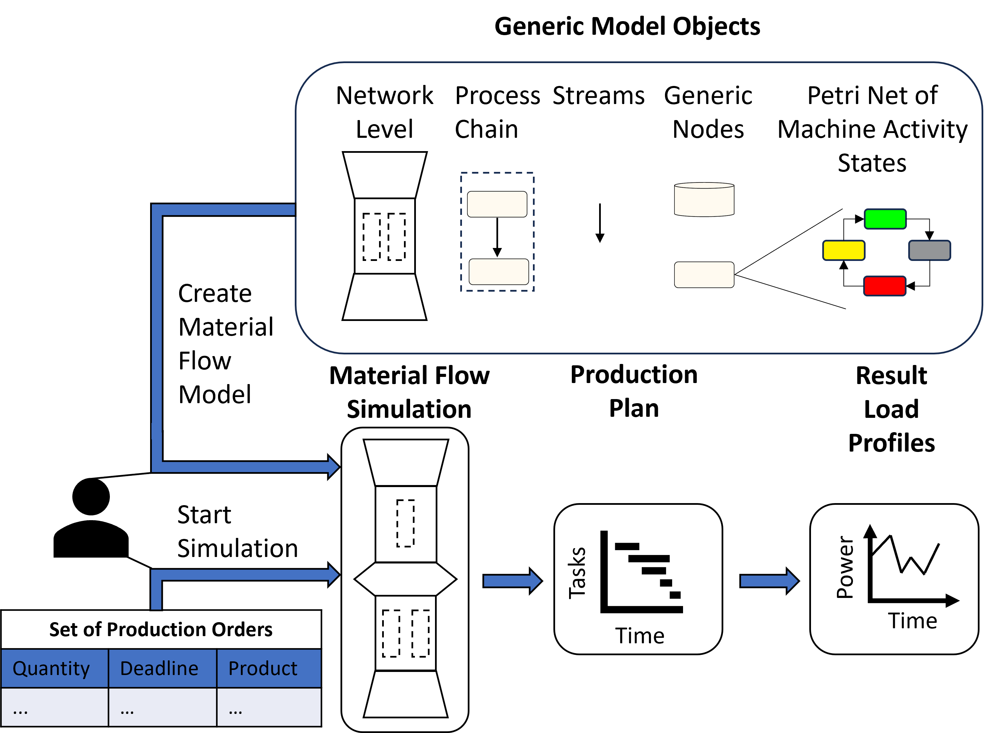

# ETHOS.PeNALPS

ETHOS.PeNALPS (Petri Net Agent based Load Profile Simulator) is a Python library for the simulation of load profiles of industrial manufacturing processes. It is part of [ETHOS (Energy Transformation Pathway Optimization Suite)](https://go.fzj.de/ethos_suite). Load profiles are energy demand time series. Processes that can be simulated using ETHOS.PeNALPS include, for example, steel, paper, and industrial food production. One or multiple product orders are passed to the model which starts the simulation and eventually creates the desired load profiles.

# Working Principle

The figure below shows the main conceptual objects of ETHOS.PeNALPS which are:

- Generic model objects
- Material flow simulations
- Production plans
- Result load profiles

The model of the material flow simulation is created by users based on generic simulation
objects. After the material flow simulation is completed, a set of production orders is passed to the model to start the simulation. The simulation generates a production plan that tracks the activity of each node to fulfill the requested set of orders. Based on the activity in the production plan, the load profiles are created for each node in therein. 



*Depiction of the main components and workflow of ETHOS.PeNALPS*

The [HTML documentation provides a tutorial](https://ethospenalps.readthedocs.io/en/latest/ethos_penalps_tutorial/overview.html) for ETHOS.PeNALPS. The executable files for the tutorial are located in the example section of this repository. Also two examples for a [toffee production process](https://ethospenalps.readthedocs.io/en/latest/examples/toffee_example.html) and a [b-pillar production process](https://ethospenalps.readthedocs.io/en/latest/examples/b_pillar_example.html) are available.


# Installation

## Requirements
The installation process uses a Conda-based Python package manager. We highly recommend using (Micro-)Mamba instead of Anaconda. The recommended way to use Mamba on your system is to install the Miniforge distribution. They offer installers for Windows, Linux and OS X. Have a look at the [Mamba installation guide](https://mamba.readthedocs.io/en/latest/installation/mamba-installation.html) for further details. In the following commands mamba and conda are exchangeable if you prefer to use conda or mamba. 


## Installation via conda-forge
The simplest way ist to install ETHOS.PeNALPS into a fresh environment from conda-forge with:

Create a new environment
```python
mamba create -n penalps_env 
```

Activate the environment
```python
mamba activate penalps_env
```

Install ETHOS.PeNALPS from conda forge
```python
mamba install -c conda-forge ethos_penalps
```

## Installation from Github for Development

First the repository must be cloned from Github

```python
git clone https://github.com/FZJ-IEK3-VSA/ETHOS_PeNALPS.git
```
Then change the directory to the root folder of the repository.
```python
cd ETHOS_PeNALPS
```

Create a new environment from the environment.yml file with all required dependencies.
```python
mamba env create --file=environment.yml
```

Activate the new environment.
```python
mamba activate ethos_penalps
```

Install ethos_penalps locally in editable to mode for development.
```python
pip install -e .
```

# Tests

The library can be tested by running pytest with the following command from the root folder.

```python
pytest
```

# Documentation 

A ReadTheDocs Documentation can be found [here](https://ethospenalps.readthedocs.io/en/latest/Introduction.html).


# Contributing

Contributions are welcome, and they are greatly appreciated! Every little bit
helps, and credit will always be given.

You can contribute in many ways:

## Types of Contributions


### Report Bugs


Report bugs at https://github.com/FZJ-IEK3-VSA/ETHOS_PeNALPS/issues.

If you are reporting a bug, please include:

* Your operating system name and version.
* Any details about your local setup that might be helpful in troubleshooting.
* Detailed steps to reproduce the bug.

### Fix Bugs

Look through the GitHub issues for bugs. Anything tagged with "bug" and "help
wanted" is open to whoever wants to implement it.

### Implement Features

Look through the GitHub issues for features. Anything tagged with "enhancement"
and "help wanted" is open to whoever wants to implement it.

### Write Documentation

ETHOS.PeNALPS could always use more documentation, whether as part of the
official ETHOS.PeNALPS docs, in docstrings, or even on the web in blog posts,
articles, and such.

### Submit Feedback


The best way to send feedback is to file an issue at https://github.com/FZJ-IEK3-VSA/ETHOS_PeNALPS/issues.

If you are proposing a feature:

- Explain in detail how it would work.
- Keep the scope as narrow as possible, to make it easier to implement.
- Remember that this is a volunteer-driven project, and that contributions
  are welcome :)