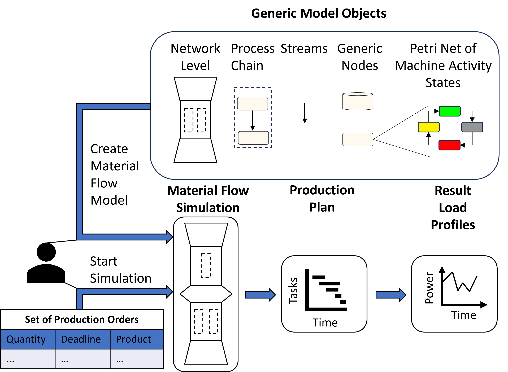

| Name | Version | Platforms | Tests |
|---|---|---|---|
|[](https://anaconda.org/conda-forge/ethos_penalps)|[](https://anaconda.org/conda-forge/ethos_penalps)|[](https://anaconda.org/conda-forge/ethos_penalps) |[](https://github.com/FZJ-IEK3-VSA/ETHOS_PeNALPS/actions/workflows/test_push.yml)

<a href="https://www.fz-juelich.de/en/ice/ice-2"></a> 
# ETHOS.PeNALPS

ETHOS.PeNALPS (Petri Net Agent based Load Profile Simulator) is a Python library for the simulation of load profiles of industrial manufacturing processes. It is part of [ETHOS (Energy Transformation Pathway Optimization Suite)](https://go.fzj.de/ethos_suite). Load profiles are energy demand time series. Processes that can be simulated using ETHOS.PeNALPS include, for example, steel, paper, and industrial food production. One or multiple product orders are passed to the model which starts the simulation and eventually creates the desired load profiles.

# Working Principle

The figure below shows the main conceptual objects of ETHOS.PeNALPS which are:

- Generic model objects
- Material flow simulations
- Production plans
- Result load profiles

The model of the material flow simulation is created by users based on generic simulation
objects. After the material flow simulation is completed, a set of production orders is passed to the model to start the simulation. The simulation generates a production plan that tracks the activity of each node to fulfill the requested set of orders. Based on the activity in the production plan, the load profiles are created for each node therein. 



*Depiction of the main components and workflow of ETHOS.PeNALPS*

The [HTML documentation provides a tutorial](https://ethospenalps.readthedocs.io/en/latest/ethos_penalps_tutorial/0_overview.html) for ETHOS.PeNALPS. The executable files for the tutorial are located in the example section of this repository. Additionally, two examples for a [toffee production process](https://ethospenalps.readthedocs.io/en/latest/examples/toffee_example.html) and a [b-pillar production process](https://ethospenalps.readthedocs.io/en/latest/examples/b_pillar_example.html) are available.


# Installation

## Requirements
The installation process uses a Conda-based Python package manager. The recommended way to use Mamba on your system is to install the Miniforge distribution. They offer installers for Windows, Linux and macOS. Have a look at the [Mamba installation guide](https://mamba.readthedocs.io/en/latest/installation/mamba-installation.html) for further details.   

```
conda install -n base conda-libmamba-solver
conda config --set solver libmamba
```

Please note that the installation time of the solver can be very long if you have installed a lot of other packages into your conda base environment. In the following the commands mamba and conda are exchangeable if you prefer to use conda.

## Installation via conda-forge
The simplest way is to install ETHOS.PeNALPS into a fresh environment from conda-forge with:

Create a new environment
```python
mamba create -n penalps_env 
```

Activate the environment
```python
mamba activate penalps_env
```

Install ETHOS.PeNALPS from conda forge
```python
mamba install -c conda-forge ethos_penalps
```

## Installation from Github for Development

First the repository must be cloned from Github

```python
git clone https://github.com/FZJ-IEK3-VSA/ETHOS_PeNALPS.git
```
Then change the directory to the root folder of the repository.
```python
cd ETHOS_PeNALPS
```

Create a new environment from the environment.yml file with all required dependencies.
```python
mamba env create --file=environment.yml
```

Activate the new environment.
```python
mamba activate ethos_penalps
```

Install ethos_penalps locally in editable mode for development.
```python
pip install -e .
```

# Tests

The library can be tested by running pytest with the following command from the root folder.

```python
pytest
```

# Documentation 

The ReadTheDocs documentation can be found [here](http://ethospenalps.readthedocs.io/).

## Contributions and Support
All contributions are welcome:
- If you have a question, you can start a [Discussion](https://github.com/FZJ-IEK3-VSA/ETHOS_PeNALPS/discussions). You will get a response as soon as possible.
- If you want to report a bug, please open an [Issue](https://github.com/FZJ-IEK3-VSA/ETHOS_PeNALPS/issues/new). We will then take care of the issue as soon as possible.
- If you want to contribute with additional features or code improvements, open a [Pull request](https://github.com/FZJ-IEK3-VSA/ETHOS_PeNALPS/pulls).

## About Us 

We are the <a href="https://www.fz-juelich.de/en/ice/ice-2">Institute of Climate and Energy Systems – Jülich Systems Analysis (ICE-2)</a> at the <a href="https://www.fz-juelich.de/en"> Forschungszentrum Jülich</a>.
Our work focuses on independent, interdisciplinary research in energy, the bioeconomy, infrastructure, and sustainability. We support a just, greenhouse gas–neutral transformation through open models and policy-relevant science.


## Code of Conduct
Please respect our [code of conduct](https://github.com/FZJ-IEK3-VSA/README_assets/blob/main/CODE_CONDUCT.md).