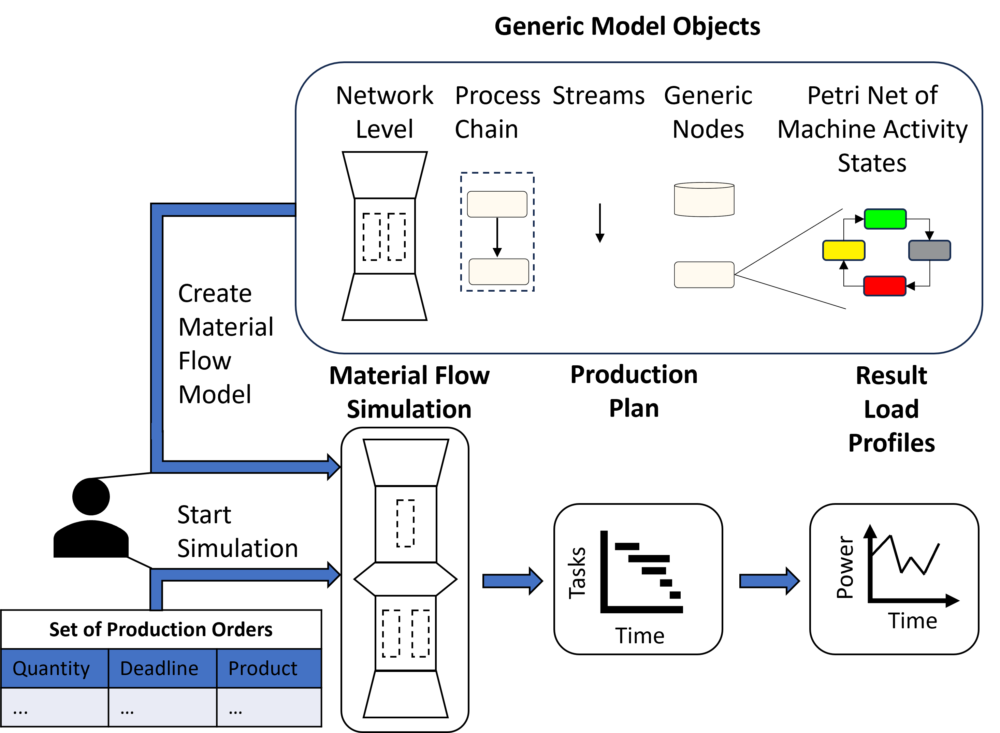

# ETHOS.PeNALPS

ETHOS.PeNALPS (Petri Net Agent based Load Profile Simulator) is a Python library for the simulation of load profiles of plants of industrial manufacturing processes. It is part of [ETHOS (Energy Transformation Pathway Optimization Suite)](https://go.fzj.de/ethos_suite). Load profiles are energy demand time series. ETHOS.PeNALPS is capable to model load profiles of production processes like steel, paper, and industrial food production.  To showcase the modeling capabilities an example for a [toffee production process](examples/toffee_example.md) and an example for a [b-pillar production process](examples/b_pillar_example.md) are provided.

# Working Principle
{numref}`main-component-overview` shows the main conceptual objects of ETHOS.PeNALPS which are:

- Generic model objects
- Material flow simulations
- Production plans
- Result load profiles

A user has to create a model of the material flow simulation based on generic simulation objects. A set of production orders is then passed to the model to start the simulation. The simulation generates a production plan that tracks the activity of each node to fulfill the requested set of orders. Based on the activity in the production plan, the load profiles are created for each node in therein. 

:::{figure-md} main-component-overview

Depiction of the main components and workflow of ETHOS.PeNALPS
:::

There is [a tutorial](ethos_penalps_tutorial/0_overview.md) which guides the user through the installation, implementation of first models and the interpretation of some results. The supported production network topologies and load profiles models are explained [here](ethos_penalps_articles/model_topology.md). Contributions are welcome, please see [the contributions guide](ethos_penalps_articles/contribution_guide.md) for further information or contact me directly j.belina@fz-juelich.de.

