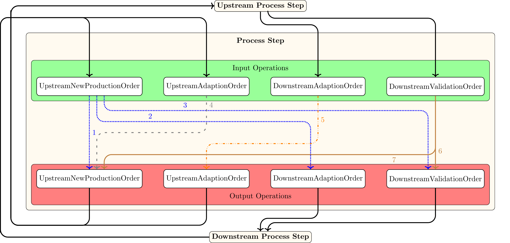

# Production Plan Creation

In order to request and adapt the streams of a process chain 4 different kind of operations can be created and received by a process step. These are:

- UpstreamNewProductionOrder
  - Contains the request for a specific stream from the sending process step
- UpstreamAdaptionOrder
  - Contains the adapted stream which is now requested instead of the first one
- DownstreamAdaptionOrder
  - Contains the adapted stream which is now requested instead of the first one
- DownstreamValidationOrder

The following graph shows:
1. Which operations are received from the Downstream and Upstream node.
2. Which operations are send to the Downstream and Upstream node
3. Which operation can be converted into which operation

:::{figure-md} node_operation_visualization_production_planning_p

This figure depicts the communication between the upstream and downstream process step. The DownstreamValidationOrder and DownstreamAdaptionOrder can be passed to respective downstream node. UpstreamNewProduction and UpstreamAdaptionOrder are passed to the respective upstream node.
:::

The communication between the process causes 7 different actions that determine how the production plan is created.
In the first path the process step creates a new input stream request as a result to an output stream request. The input operation is an UpstreamNewProductionOrder and the output order is a new UpstreamNewProductionOrder.  

:::{figure-md} path_1_figure_p

Path 1: A new output stream request leads to new input stream request.
:::

In the second path the process step receives a new output stream request but the process step is still busy. Thus an adaption for the output stream is requested.  
:::{figure-md} path_2_figure_p

Path 2: The output stream can not be supplied as requested. Therefore the request is adapted.
:::

In the third path an output stream request is supplied directly from the storage. Due to sufficient mass in the storage no input stream is requested. 
:::{figure-md} path_3_figure_p

Path 3: The output stream request is supplied directly from the storage without an input stream request.
:::

The fourth path request a new input stream as a result to an output stream as in the first path. The difference is that the output stream has been adapted before so that it can be supplied by the current output stream.
:::{figure-md} path_4_figure_p

Path 4: A new input stream is requested to supply an output stream. The output stream has been adapted before so that it can be supplied.
:::

In the fifth path an adaption for an input stream is requested because the upstream process step is busy. Thus the input state has to be extended. 
:::{figure-md} path_5_figure_p

Path 5: The previously requested input stream is adapted because the upstream process step can not supply it as requested. Thus the input state is extended. 
:::

In the sixth path the current process step receives a validation from the upstream process step that the requested input stream can be delivered as requested. The process state switches into an idle state and is ready to process new output stream request.
:::{figure-md} path_6_figure_p

Path 6: The sixth path validates that sufficient input mass is supplied in time to provide the requested input stream. The process state switches back into an idle state.
:::

In the seventh path the upstream process step validates that the requested input stream can be provided as requested. The process step still requires more input mass to fulfill the the output stream.
:::{figure-md} path_7_figure_p

Path 7: The previously requested input stream is validated. Another input stream is requested because there is still input mass missing.
:::
