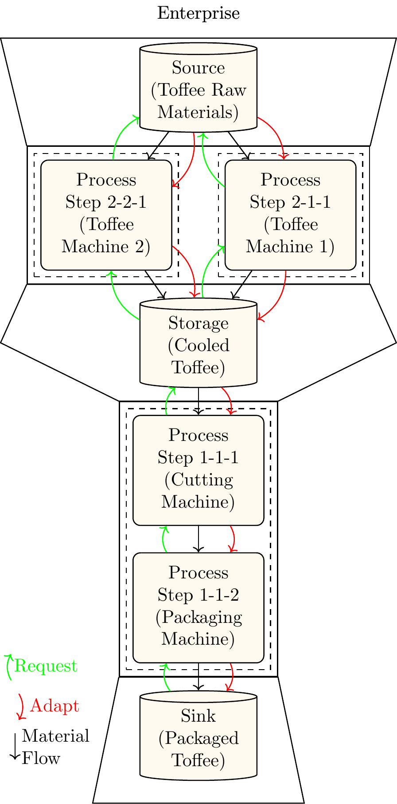

# How To Setup a Model

In order to setup an ETHOS.PeNALPS Model a set of hierarchical objects must be created. Each object has a method that creates the objects below itself in the hierarchy. The user should start with instantiation of an enterprise and start to create NetworkLayers from it. The NetworkLevel can then be used to create Source, Sink, ProcessChain Objects and so on.

These are:
- [Enterprise](../autoapi/ethos_penalps/enterprise/index.rst)
  - [NetworkLevel](../autoapi/ethos_penalps/network_level/index.rst)
    - [Source](../autoapi/ethos_penalps/process_nodes/source/index.rst)
    - [Sink](../autoapi/ethos_penalps/process_nodes/sink/index.rst)
    - [ProcessChainStorage](../autoapi/ethos_penalps/process_nodes/process_chain_storage/index.rst)
    - [ProcessChain](../autoapi/ethos_penalps/process_chain/index.rst)
      - [Process Step](../autoapi/ethos_penalps/process_nodes/process_step/index.rst)
        - [ProcessStateHandler](../autoapi/ethos_penalps/process_state_handler/index.rst) (Container for the Process Petri Net)
           - [ProcessState](../autoapi/ethos_penalps/process_state/index.rst)
           - [ProcessStateSwitchSelectorHandler](../autoapi/ethos_penalps/process_state_switch_selector/index.rst)
             - [ProcessStateSwitchSelector](../autoapi/ethos_penalps/process_state_switch_selector/index.rst)
           - [ProcessStateSwitchHandler](../autoapi/ethos_penalps/process_state_switch/index.rst)
             - [ProcessStateSwitch](../autoapi/ethos_penalps/process_state_switch/index.rst)
      - [StreamHandler](../autoapi/ethos_penalps/stream_handler/index.rst)
        - [ContinuousStream](../autoapi/ethos_penalps/stream/index.rst)
        - [BatchStream](../autoapi/ethos_penalps/stream/index.rst)

An example ETHOS.PeNALPS model for a toffee production process is shown in {numref}`toffee-production-example`. The model consists of:

- One Enterprise
- Two NetworkLevel
  - First NetworkLevel
    - One Source
    - Two Process Chains
      - One Process Step in each chain
      - Two Streams in each chain
    - OneProcessChainStorage
  - Second NetworkLevel
    - OneProcessChainStorage (The same as in the other NetworkLevel)
    - One ProcessChain
      - Two Process Steps
      - Three stream
    - One Sink

:::{figure-md} toffee-production-example

Depiction of the model of the toffee production example.
:::

The respective model is divided into four python modules to decrease the module length. The simulation_starter.py contains the Enterprise, NetworkLevel and initializes the empty process chains. The other three modules toffee_preparation_chain_1, toffee_preparation_chain_2 and cutting_and_packaging_chain.py are used to initialize all objects in the process chains.

