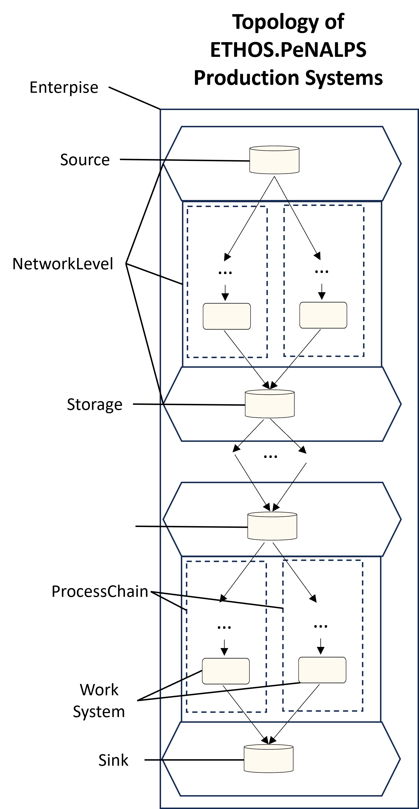
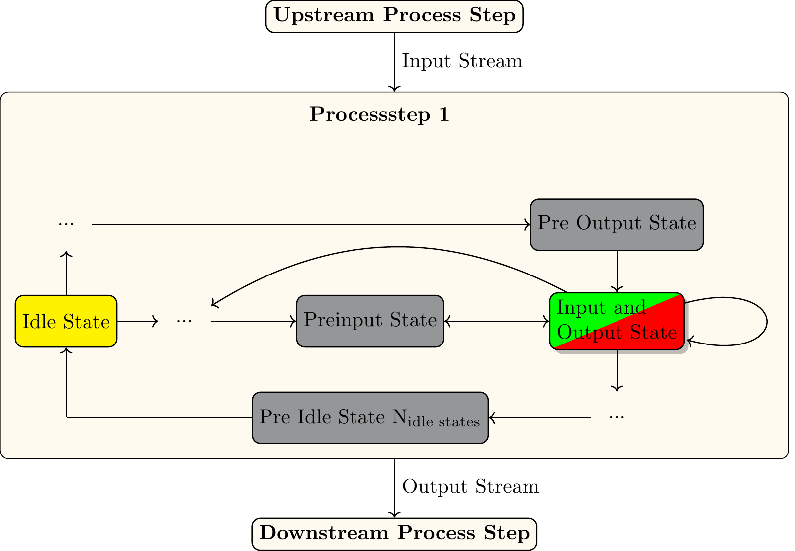
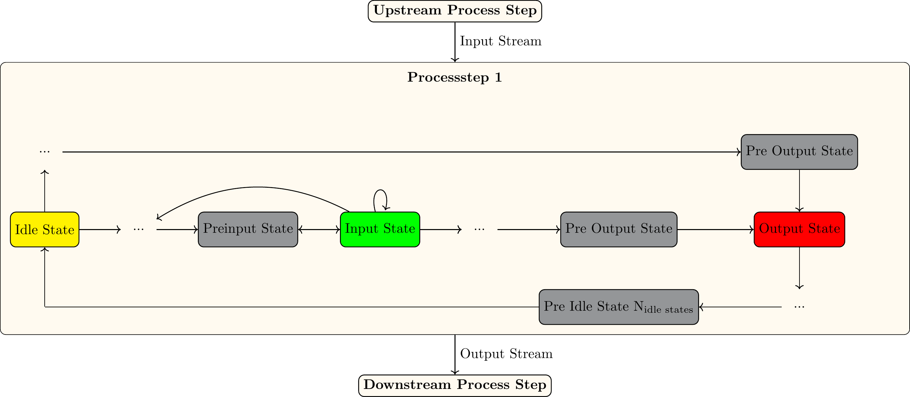

# Production System Topology and Main Model Components

ETHOS.PeNALPS can model acyclical production sys as shown in {numref}`production-system-topology`. 

:::{figure-md} production-system-topology

Depiction of the possible topology of production systems of ETHOS.PeNALPS models.
:::

The production systems consists of:

- Exactly one [Enterprise](../autoapi/ethos_penalps/enterprise/index.rst).
- One or more [NetworkLevel](../autoapi/ethos_penalps/network_level/index.rst).
  - Exactly one [Source](../autoapi/ethos_penalps/process_nodes/source/index.rst) in the upper NetworkLevel.
  - Exactly one [Sink](../autoapi/ethos_penalps/process_nodes/sink/index.rst) in the lower NetworkLevel.
  - One [ProcessChainStorage](../autoapi/ethos_penalps/process_nodes/process_chain_storage/index.rst) to    
  connect two NetworkLevel.
  - One or more [ProcessChain](../autoapi/ethos_penalps/process_chain/index.rst) per NetworkLevel
      - One more  [Process Step](../autoapi/ethos_penalps/process_nodes/process_step/index.rst) per process chain.
  - One [StreamHandler](../autoapi/ethos_penalps/stream_handler/index.rst) per NetworkLevel
    - One stream for each connection between multiple process Steps, between source and process step and sink and process step.
      - The stream can be either a [ContinuousStream](../autoapi/ethos_penalps/stream/index.rst) or a[BatchStream](../autoapi/ethos_penalps/stream/index.rst). They differ in their mass transfer characteristic for storages. Continuous streams transport mass continuously and batch streams transport mass in discrete steps.

# Petri Net

Additionally each of the process step requires a Petri-Net. There are two generic versions of petri nets which can be implemented which are shown in {numref}`petri-net-combined-input-output-topology` and {numref}`petri-net-separate-input-output-topology`. Each of node in the petri net is a [ProcessState](../autoapi/ethos_penalps/process_state/index.rst). To model a transition which is indicated by the arrows a [ProcessStateSwitchSelector](../autoapi/ethos_penalps/process_state_switch_selector/index.rst) which contains at least one [ProcessStateSwitch](../autoapi/ethos_penalps/process_state_switch/index.rst) is required.

:::{figure-md} petri-net-combined-input-output-topology

Generic depiction of a process state petri net with separate input and output state
:::

:::{figure-md} petri-net-separate-input-output-topology

Generic depiction of a process state petri net with separate input and output state
:::

The Petri-Net ist stored in the following structure for each process step:

- Exactly one [ProcessStateHandler](../autoapi/ethos_penalps/process_state_handler/index.rst) (Container for the Process Petri Net) per process step.
    - Exactly one [ProcessStateSwitchSelectorHandler](../autoapi/ethos_penalps/process_state_switch_selector/index.rst) process state handler. it stores all [ProcessStateSwitchSelectors](../autoapi/ethos_penalps/process_state_switch_selector/index.rst).
      - Exactly one [ProcessStateSwitchHandler](../autoapi/ethos_penalps/process_state_switch/index.rst) per process state switch selector handler. It stores all [ProcessStateSwitches](../autoapi/ethos_penalps/process_state_switch/index.rst)

