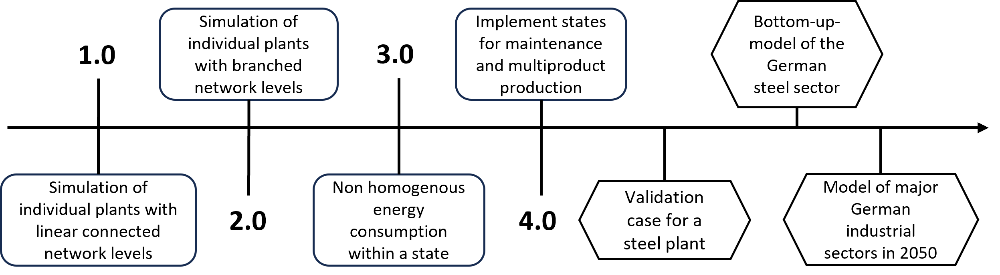
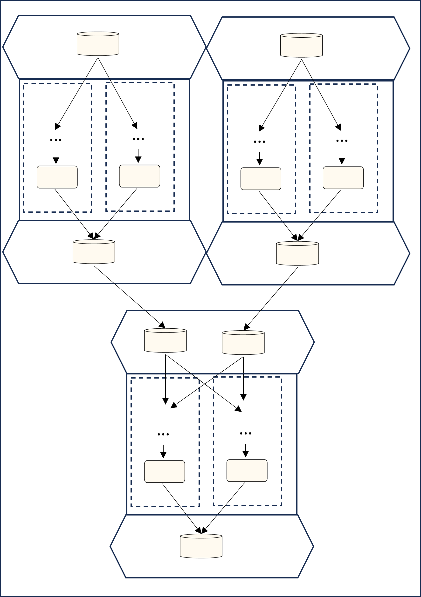

# Roadmap for ETHOS.PeNALPS

The vision for ETHOS.PeNALPS is to become a tool to create bottom-up models for annual load profiles of industrial sectors which is shown in {numref}`roadmap-depiction`. The first version 1.0 is already able to model a subset of all industrial plants with linearly connected network levels. The possible topology has been described in the [previous section](model_topology.md). 

:::{figure-md} roadmap-depiction

Depiction of the possible topology of production systems of ETHOS.PeNALPS models.
:::

Version 2.0 will add the capability to model branched connections between three and more network level which is shown in {numref}`roadmap-depiction`. Also it allows to add more sinks and sources to production system. 

:::{figure-md} version-2.0-depiction

Depiction of the possible topology of production systems of ETHOS.PeNALPS models.
:::

Version 3.0 will add the possibility to model non average energy consumption within a machine state. This will allow a more precise model of transient energy consumption states and to include load profiles from measurements or other models.
Version 4.0 will increase the complexity of the machine petri net states to model multi product production and various maintenance and failure states. With version 4.0 all sufficient model capabilities should be implemented to model annual load profiles of steel plants which should be proved in a validation case. The validated plant load profiles should the be used create bottom-up load profile of the german steel sector. This should be the basis to create load profiles for the major industrial sectors of Germany in 2050.