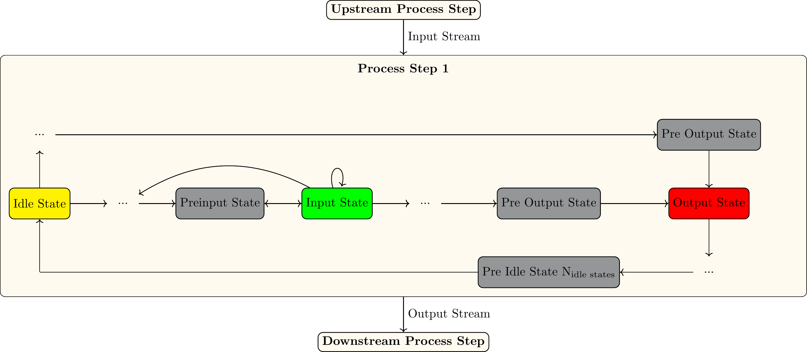

# Simulation Workflow 

This page describes how an ETHOS.PeNALPS simulation works internally. The workflow is depicted in {numref}`ethos-penalps-workflow`. The three simulation main components are:

a. The Material Flow Simulation
b. Production Plan
c. Load Profiles

The material flow simulation creates a production plan which tracks all activities, intermediate product and raw materials that are required to produce a set of product orders at a given deadline. The activity schedule is then used to calculate load profiles using specific energy demands. These energy demands are specific to the mass that is converted during the activity. The Material flow simulation is capable of modeling noncyclical industrial production networks.

:::{figure-md} ethos-penalps-workflow

Depiction of a simulation workflow of an example ETHOS.PeNALPS model.
:::

The material flow simulation in its core consists nodes which are connected by streams. The streams determine the direction of the material flow. Nodes provide and create requests for streams. The node and stream activity is tracked in the production plan. Furthermore, there are node container objects which organize groups of nodes. 

The node container objects are:
- NetworkLevel 
- ProcessChains

NetworkLevel are a collection of at least one process chain. Multiple process chains can be added to simulate the parallel operation of process chains with the same input and output. A process chain converts raw materials into a product or intermediate product. Multiple NetworkLevel can be combined sequentially to model a network of manufacturing steps.

Process chains consists of a set of sequential nodes which have different purposes:

- Process step
  - Converts an input material into an output material
- Source
  - Is the start point of the material flow
- Sink
  - Is the end point of material flow
- NetworkLevelStorage
  - Is used to connect two NetworkLevel

A process chain consists of at least one process step, one Source or NetworkLevelStorage as a start point and one Sink or NetworkLevelStorage as an end point.

The nodes act as agents which provide material, request  material or both does both. Process steps provide output streams that are requested by the down stream node. They determine the required input stream request it from the upstream node. Sinks are a container for set of product orders which must be specified by the user. They request input streams until all orders are fulfilled. Sources are the start point of a material flow simulation. They provide all output stream requests that are passed to them without constraints.

ProcessChainStorages work first as source and later as a sink in the simulation. They are used to connect NetworkLevel which are one of two container objects. 

The activity and capacity of a process step during production is determined by Petri Net of States. A generic petri net is depicted in {numref}`petri-net_separate-input-output`. While fulfilling the request, a process node switches a cycle through its petri net.  The places of the petri net are the machine states of the modeled machine. There are four different kinds of states:

1. Idle state (yellow), which is the start and end point82
2. Input state (green), determines the activity of the input stream83
3. Output state (red), determines the activity of the output stream84
4. Intermediate state (gray), resembles a specific task or phase of the production

They are ordered by temporal occurrence during production. To fulfill a request for an output stream, the process step switches over a full cycle from idle state to idle state. Each active state during the switch cycle is tracked in the production plan, which simulates the machine’s activity. Even though the states are stored in the correct forward temporal order, the internal switches occur in the opposite temporal direction. This is useful because the output request that is passed to the process step only provides the required time frame for the output state. 

:::{figure-md} petri-net_separate-input-output

Generic depiction of a process state petri net with separate input and output state
:::

## Load Profile Creation
Load profiles can be generated based on the mass that is transported in the streams or that is stored in the storage of a process step. The following graph shows an example in a load profile is associated with an input stream, an intermediate state and an output stream.
