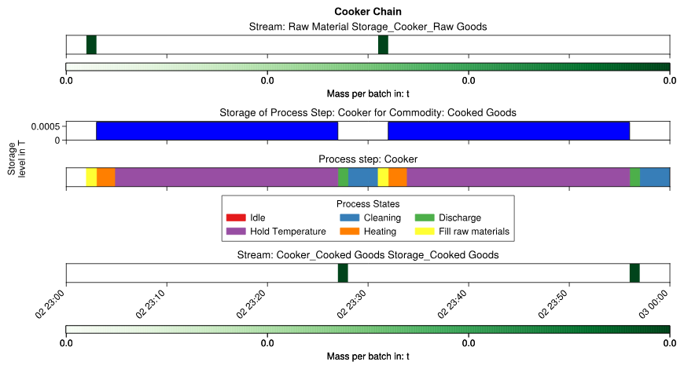
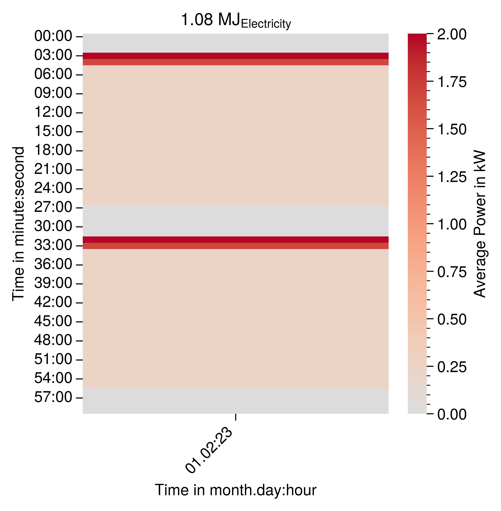

# Add More States

The energy relevant behavior of the cooker [of the previous example](1_single_cooker_process_chain.md) can be modeled in greater detail by adding more states to the petri net of the cooker. Instead of modeling a single cooking phase two phases are implemented. The first one is the heating phase which uses the maximum power of the cooker to reach the boiling temperature. The second phase uses less power and only holds the target temperature. Additionally, a cleaning phase is added after the discharge phase. 

```
idle_state = process_step.process_state_handler.create_idle_process_state(
    process_state_name="Idle"
)
fill_raw_materials_state = (
    process_step.process_state_handler.create_batch_input_stream_requesting_state(
        process_state_name="Fill raw materials"
    )
)

heating_state = process_step.process_state_handler.create_intermediate_process_state_energy_based_on_stream_mass(
    process_state_name="Heating"
)

hold_temperature_state = process_step.process_state_handler.create_intermediate_process_state_energy_based_on_stream_mass(
    process_state_name="Hold Temperature"
)

discharge_goods_state = (
    process_step.process_state_handler.create_batch_output_stream_providing_state(
        process_state_name="Discharge"
    )
)

cleaning_state = process_step.process_state_handler.create_intermediate_process_state_energy_based_on_stream_mass(
    process_state_name="Cleaning"
)
```
Each of the new intermediate states is connected with an additional process state switch delay. To determine the length of the heating phase it is assumed that the cooker has a maximum power of $2000 W$. It is assumed that the water is heated from 20 °C to 100°C assuming a heat capacity of $c_P=4.2 KJ/(kg*K)$.

$$
E_{heating, state} = m_{potato,water}*c_{p,water}*(T_{target}-T_{start})
=650 g *4.2kj/kg *(100°C-20°C)≈0.06066667kWh
$$
$$
t_{heating,state}=E_{heating, state}/P_{max}≈0.06066667kWh/2000W≈1.82 minutes
$$

It is assumed that the total cooking time does not change.

$$
t_{hold_temperature,state}=t_{cooking, state}-t_{heating, state}=24 minutes -1.82 minutes= 22.18 minutes
$$

The durations of the states are now passed to the process state switches.

```
activate_not_cooking = process_step.process_state_handler.process_state_switch_selector_handler.process_state_switch_handler.create_process_state_switch_at_next_discrete_event(
    start_process_state=cleaning_state,
    end_process_state=idle_state,
)
process_step.process_state_handler.process_state_switch_selector_handler.create_single_choice_selector(
    process_state_switch=activate_not_cooking
)

activate_filling = process_step.process_state_handler.process_state_switch_selector_handler.process_state_switch_handler.create_process_state_switch_at_input_stream(
    start_process_state=idle_state,
    end_process_state=fill_raw_materials_state,
)

process_step.process_state_handler.process_state_switch_selector_handler.create_single_choice_selector(
    process_state_switch=activate_filling
)

activate_heating = process_step.process_state_handler.process_state_switch_selector_handler.process_state_switch_handler.create_process_state_switch_delay(
    start_process_state=fill_raw_materials_state,
    end_process_state=heating_state,
    delay=datetime.timedelta(minutes=1.82),
)

process_step.process_state_handler.process_state_switch_selector_handler.create_single_choice_selector(
    process_state_switch=activate_heating
)
activate_hold_temperature = process_step.process_state_handler.process_state_switch_selector_handler.process_state_switch_handler.create_process_state_switch_delay(
    start_process_state=heating_state,
    end_process_state=hold_temperature_state,
    delay=datetime.timedelta(minutes=22.18),
)

process_step.process_state_handler.process_state_switch_selector_handler.create_single_choice_selector(
    process_state_switch=activate_hold_temperature
)


activate_discharging = process_step.process_state_handler.process_state_switch_selector_handler.process_state_switch_handler.create_process_state_switch_at_output_stream(
    start_process_state=hold_temperature_state,
    end_process_state=discharge_goods_state,
)
process_step.process_state_handler.process_state_switch_selector_handler.create_single_choice_selector(
    process_state_switch=activate_discharging
)
activate_hold_temperature = process_step.process_state_handler.process_state_switch_selector_handler.process_state_switch_handler.create_process_state_switch_delay(
    start_process_state=discharge_goods_state,
    end_process_state=cleaning_state,
    delay=datetime.timedelta(minutes=3),
)

process_step.process_state_handler.process_state_switch_selector_handler.create_single_choice_selector(
    process_state_switch=activate_hold_temperature
)
```

Now the the energy data must be updated to model the different energy usage in both states. Therefore, the energy demand must be converted to $MJ/t$ for each state. It is assumed that the total energy demand does not change. The heat demand for hold temperature state is:

$$
E_{hold_temperature, state} = E_{total}-E_{heating, state}= 0.15 kWH -0.06066667kWh= 0.089333333kWh
$$

The energy demand for both phases is converted into a mass specific energy demands using the following equations:

$$
SEC_{heating, state}=E_{heating, state}/m_{potato,water}=0.06066667kWh/650 g=336.0 MJ/t
$$

$$
SEC_{hold_temperature, state}=E_{hold_temperature, state}/m_{potato,water}=0.089333333kWh/650 g=494.7692307692307 MJ/t
$$

In this case it is assumed that no energy is used during the cleaning.

```
electricity_load = LoadType(name="Electricity")
heating_state.create_process_state_energy_data_based_on_stream_mass(
    specific_energy_demand=332.31,
    load_type=electricity_load,
    stream=raw_materials_to_cooking_stream,
)
hold_temperature_state.create_process_state_energy_data_based_on_stream_mass(
    specific_energy_demand=498.46,
    load_type=electricity_load,
    stream=raw_materials_to_cooking_stream,
)
```
## Simulation Results


### Production Plan
Figure {numref}`gantt-chart-more-states-cooker` shows the gantt chart of the cooker with the additional states. Compared to the previous example
it can be seen that the cooking state is replaced by the two states heating and hold temperature. Also the cleaning state has been added. Due to the cleaning more time between the two cooking sessions is required.


:::{figure-md} gantt-chart-more-states-cooker


Gantt chart of the cooker model with additional states, the input stream and the output stream.
:::

### Load Profiles

The influence of the heating and hold temperature state can been seen in {numref}`gantt-chart-more-states-cooker`. It has a high power demand state (heating) followed by a lower power demand state (hold temperature). The cooker operates at the maximum power of 2000W during the heating state. This is a result of the assumptions about the energy demand of the states.

:::{figure-md} carpet-plot-more-states-cooker


Carpet plot of the load profiles of the cooker model with more states.
:::
 
The next example shows how to implement multiple cookers that operate in parallel.
