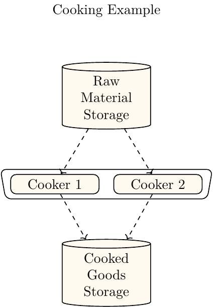
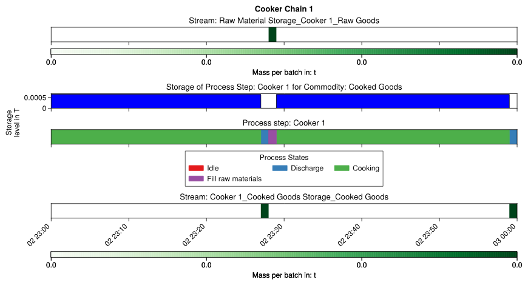
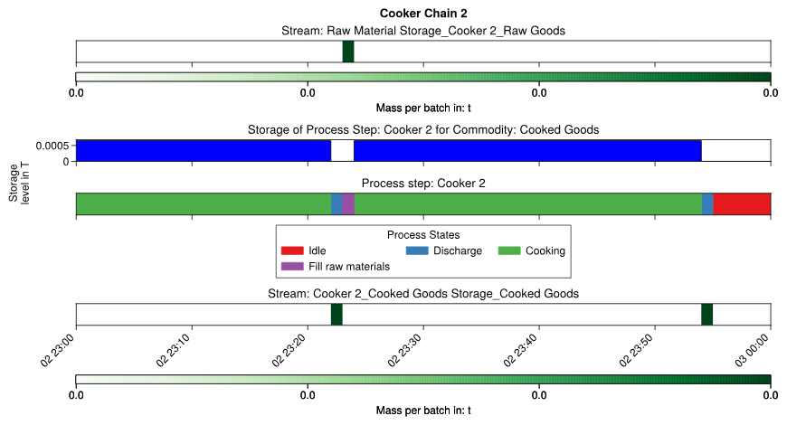
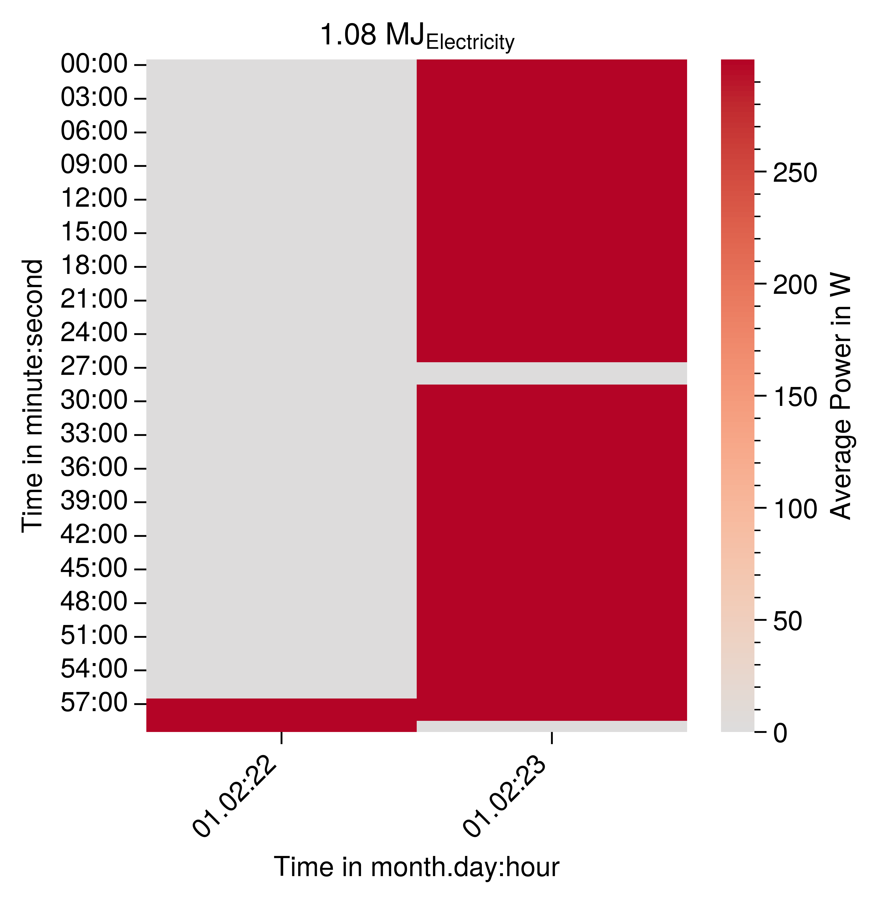
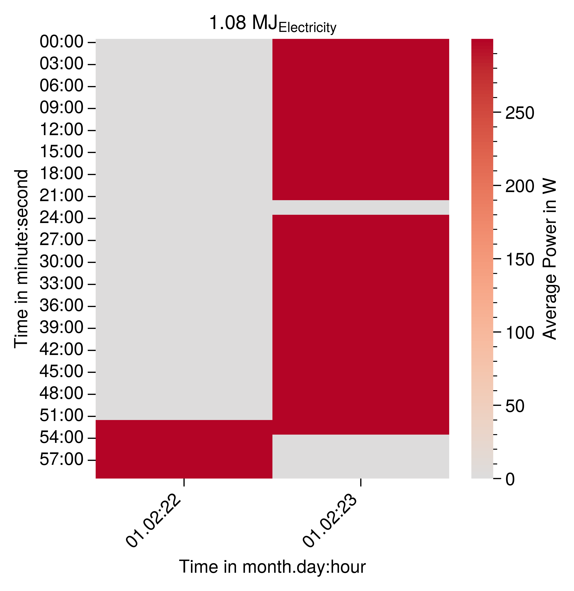
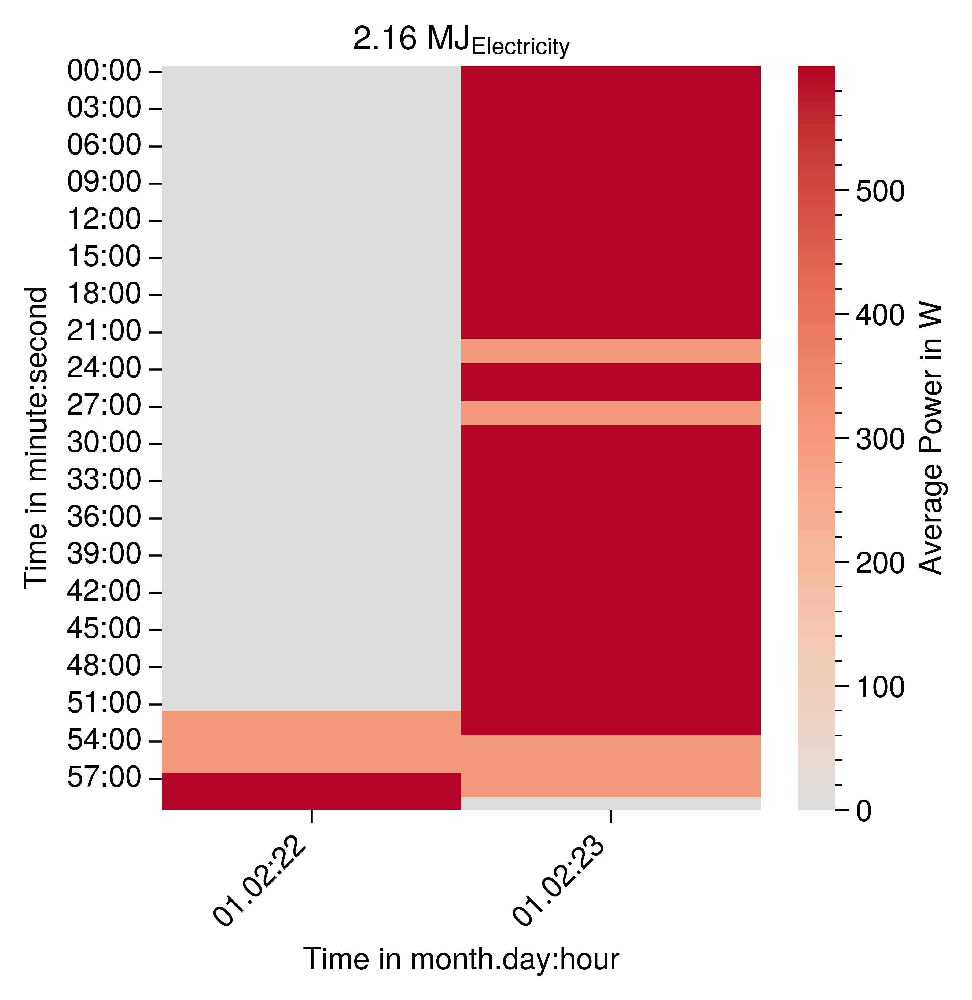

# Add More Cookers for Parallel Operation

This sections explains how to model the parallel operation of two process steps. Therefore an additional cooker is added to the previous cooker example which is shown in {numref}`cooking-example-two-cooker`.
:::{figure-md} cooking-example-two-cooker


Depiction of the cooker model with two parallel cookers.
:::

## Increase Number of Orders and Shift Orders

The number of orders is doubled to create a similar production load for each cookers as in the previous examples. Additionally, the orders are shifted
by five minutes to show that each of the cooker can operate independently from each other.

```
order_generator = NOrderGenerator(
    commodity=output_commodity,
    mass_per_order=0.00065,
    production_deadline=end_date,
    number_of_orders=4,
    time_span_between_order=datetime.timedelta(minutes=5),
)
```

 

## Create Two Process Chains
To implement two parallel operating cookers two process chains must be created. 

```
process_chain_1 = network_level.create_process_chain(
    process_chain_name="Cooker Chain 1"
)
process_chain_2 = network_level.create_process_chain(
    process_chain_name="Cooker Chain 2"
)
```
## Connect Chains with Sink and Source
Both chains must then be connected to the sink and source

```
process_chain_1.add_sink(sink=sink)
process_chain_1.add_source(source=source)
process_chain_2.add_sink(sink=sink)
process_chain_2.add_source(source=source)
```
## Create Two Process Steps
Each of the chains must hold an own instance of the cooker. It is important that the names of the process steps are unique.
```
process_step_1 = process_chain_1.create_process_step(name="Cooker 1")
process_step_2 = process_chain_2.create_process_step(name="Cooker 2")
```

## Create Streams
Afterwards an own input and output stream must be created for each of the process steps.
```
raw_materials_to_cooking_stream_1 = process_chain_1.stream_handler.create_batch_stream(
    batch_stream_static_data=BatchStreamStaticData(
        start_process_step_name=source.name,
        end_process_step_name=process_step_1.name,
        delay=datetime.timedelta(minutes=1),
        commodity=input_commodity,
        maximum_batch_mass_value=0.00065,
    )
)
cooking_to_sink_stream_1 = process_chain_1.stream_handler.create_batch_stream(
    batch_stream_static_data=BatchStreamStaticData(
        start_process_step_name=process_step_1.name,
        end_process_step_name=sink.name,
        delay=datetime.timedelta(minutes=1),
        commodity=output_commodity,
        maximum_batch_mass_value=0.00065,
    )
)

raw_materials_to_cooking_stream_2 = process_chain_2.stream_handler.create_batch_stream(
    batch_stream_static_data=BatchStreamStaticData(
        start_process_step_name=source.name,
        end_process_step_name=process_step_2.name,
        delay=datetime.timedelta(minutes=1),
        commodity=input_commodity,
        maximum_batch_mass_value=0.00065,
    )
)
cooking_to_sink_stream_2 = process_chain_2.stream_handler.create_batch_stream(
    batch_stream_static_data=BatchStreamStaticData(
        start_process_step_name=process_step_2.name,
        end_process_step_name=sink.name,
        delay=datetime.timedelta(minutes=1),
        commodity=output_commodity,
        maximum_batch_mass_value=0.00065,
    )
)
```

## Connect Streams
Then both of the streams must be connected to respective sink and source. 

```
source.add_output_stream(
    output_stream=raw_materials_to_cooking_stream_1,
    process_chain_identifier=process_chain_1.process_chain_identifier,
)
sink.add_input_stream(
    input_stream=cooking_to_sink_stream_1,
    process_chain_identifier=process_chain_1.process_chain_identifier,
)
source.add_output_stream(
    output_stream=raw_materials_to_cooking_stream_2,
    process_chain_identifier=process_chain_2.process_chain_identifier,
)
sink.add_input_stream(
    input_stream=cooking_to_sink_stream_2,
    process_chain_identifier=process_chain_2.process_chain_identifier,
)
```
## Create Petri Nets
Afterwards the petri net must be created for each of the process steps. For the sake of brevity the simpler petri net from the initial example is used:

### Cooker 1:
```
idle_state_1 = process_step_1.process_state_handler.create_idle_process_state(
    process_state_name="Idle"
)
fill_raw_materials_state_1 = (
    process_step_1.process_state_handler.create_batch_input_stream_requesting_state(
        process_state_name="Fill raw materials"
    )
)

cooking_state_1 = process_step_1.process_state_handler.create_intermediate_process_state_energy_based_on_stream_mass(
    process_state_name="Cooking"
)

discharge_goods_state_1 = (
    process_step_1.process_state_handler.create_batch_output_stream_providing_state(
        process_state_name="Discharge"
    )
)

activate_not_cooking_1 = process_step_1.process_state_handler.process_state_switch_selector_handler.process_state_switch_handler.create_process_state_switch_at_next_discrete_event(
    start_process_state=discharge_goods_state_1,
    end_process_state=idle_state_1,
)
process_step_1.process_state_handler.process_state_switch_selector_handler.create_single_choice_selector(
    process_state_switch=activate_not_cooking_1
)

activate_filling_1 = process_step_1.process_state_handler.process_state_switch_selector_handler.process_state_switch_handler.create_process_state_switch_at_input_stream(
    start_process_state=idle_state_1,
    end_process_state=fill_raw_materials_state_1,
)

process_step_1.process_state_handler.process_state_switch_selector_handler.create_single_choice_selector(
    process_state_switch=activate_filling_1
)

activate_cooking_1 = process_step_1.process_state_handler.process_state_switch_selector_handler.process_state_switch_handler.create_process_state_switch_delay(
    start_process_state=fill_raw_materials_state_1,
    end_process_state=cooking_state_1,
    delay=datetime.timedelta(minutes=30),
)

process_step_1.process_state_handler.process_state_switch_selector_handler.create_single_choice_selector(
    process_state_switch=activate_cooking_1
)


activate_discharging_1 = process_step_1.process_state_handler.process_state_switch_selector_handler.process_state_switch_handler.create_process_state_switch_at_output_stream(
    start_process_state=cooking_state_1,
    end_process_state=discharge_goods_state_1,
)
process_step_1.process_state_handler.process_state_switch_selector_handler.create_single_choice_selector(
    process_state_switch=activate_discharging_1
)
```

### Cooker 2

```
# Process Step 2

idle_state_2 = process_step_2.process_state_handler.create_idle_process_state(
    process_state_name="Idle"
)
fill_raw_materials_state_2 = (
    process_step_2.process_state_handler.create_batch_input_stream_requesting_state(
        process_state_name="Fill raw materials"
    )
)

cooking_state_2 = process_step_2.process_state_handler.create_intermediate_process_state_energy_based_on_stream_mass(
    process_state_name="Cooking"
)

discharge_goods_state_2 = (
    process_step_2.process_state_handler.create_batch_output_stream_providing_state(
        process_state_name="Discharge"
    )
)

activate_not_cooking_2 = process_step_2.process_state_handler.process_state_switch_selector_handler.process_state_switch_handler.create_process_state_switch_at_next_discrete_event(
    start_process_state=discharge_goods_state_2,
    end_process_state=idle_state_2,
)
process_step_2.process_state_handler.process_state_switch_selector_handler.create_single_choice_selector(
    process_state_switch=activate_not_cooking_2
)

activate_filling_2 = process_step_2.process_state_handler.process_state_switch_selector_handler.process_state_switch_handler.create_process_state_switch_at_input_stream(
    start_process_state=idle_state_2,
    end_process_state=fill_raw_materials_state_2,
)

process_step_2.process_state_handler.process_state_switch_selector_handler.create_single_choice_selector(
    process_state_switch=activate_filling_2
)

activate_cooking_2 = process_step_2.process_state_handler.process_state_switch_selector_handler.process_state_switch_handler.create_process_state_switch_delay(
    start_process_state=fill_raw_materials_state_2,
    end_process_state=cooking_state_2,
    delay=datetime.timedelta(minutes=30),
)

process_step_2.process_state_handler.process_state_switch_selector_handler.create_single_choice_selector(
    process_state_switch=activate_cooking_2
)


activate_discharging_2 = process_step_2.process_state_handler.process_state_switch_selector_handler.process_state_switch_handler.create_process_state_switch_at_output_stream(
    start_process_state=cooking_state_2,
    end_process_state=discharge_goods_state_2,
)
process_step_2.process_state_handler.process_state_switch_selector_handler.create_single_choice_selector(
    process_state_switch=activate_discharging_2
)
```

## Add Energy Data

Now the energy data must be added two the states of each machine.
```
electricity_load = LoadType(name="Electricity")
cooking_state_1.create_process_state_energy_data_based_on_stream_mass(
    specific_energy_demand=830.76,
    load_type=electricity_load,
    stream=raw_materials_to_cooking_stream_1,
)
cooking_state_2.create_process_state_energy_data_based_on_stream_mass(
    specific_energy_demand=830.76,
    load_type=electricity_load,
    stream=raw_materials_to_cooking_stream_2,
)
```

## Create Mass Balances and Storages 
The last step is to add an own mass balance and storage to each of the process steps. 
```
process_step_1.create_main_mass_balance(
    commodity=output_commodity,
    input_to_output_conversion_factor=1,
    main_input_stream=raw_materials_to_cooking_stream_1,
    main_output_stream=cooking_to_sink_stream_1,
)

process_step_1.process_state_handler.process_step_data.main_mass_balance.create_storage(
    current_storage_level=0
)


process_step_2.create_main_mass_balance(
    commodity=output_commodity,
    input_to_output_conversion_factor=1,
    main_input_stream=raw_materials_to_cooking_stream_2,
    main_output_stream=cooking_to_sink_stream_2,
)


process_step_2.process_state_handler.process_step_data.main_mass_balance.create_storage(
    current_storage_level=0
)
```

## Simulation Results

The simulation is started in the same as in the previous example. It does not depend on the configuration of process steps, process chains and network level. In the following the results of the example simulation are shown. 

### Production Plan
Figure {numref}`two-parallel-cooker-1-gantt-chart` and figure {numref}`two-parallel-cooker-2-gantt-chart` show the Gantt Chart of cooker one and two. The only difference between both figures is that they are shifted a little bit. This is caused by the shifted deadlines of the orders. These are distributed equally between both process chains by the sink. 

:::{figure-md} two-parallel-cooker-1-gantt-chart


Depiction of the production plan of cooker 1 as a Gantt Chart.
:::

:::{figure-md} two-parallel-cooker-2-gantt-chart


Depiction of the production plan of cooker 2 as a Gantt Chart.
:::

### Load Profiles

Figure {numref}`two-parallel-cooker-1-carpet-plot` and figure {numref}`two-parallel-cooker-2-carpet-plot` show the simulated electricity load profile. It has been resampled to a uniform time step which is required to create a carpet plot. In both figures it can be seen that the energy demand is interrupted by the charging and discharging states. Their only difference is that they are shifted due to the shifted orders.

:::{figure-md} two-parallel-cooker-1-carpet-plot


Depiction of the electricity load profile of cooker 1 as a carpet plot.
:::

:::{figure-md} two-parallel-cooker-2-carpet-plot


Depiction of the electricity load profile of cooker 1 as a carpet plot.
:::

Figure {numref}`two-parallel-cooker-combined-electricity-carpet-plot` shows the combined carpet plot of cooker one and two. It shows varying power consumption of the whole production system due to the charging states, discharging states and the asynchronous operation of both cookers.  

:::{figure-md} two-parallel-cooker-combined-electricity-carpet-plot


Depiction of the combined electricity load profile of cooker 1 and cooker 2 as a carpet plot.
:::

The next example shows how to connect two process steps exclusively using a process chain.