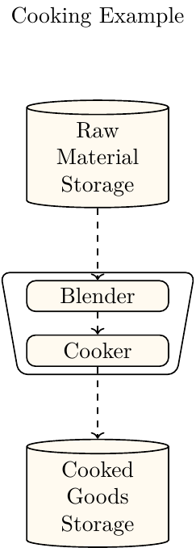
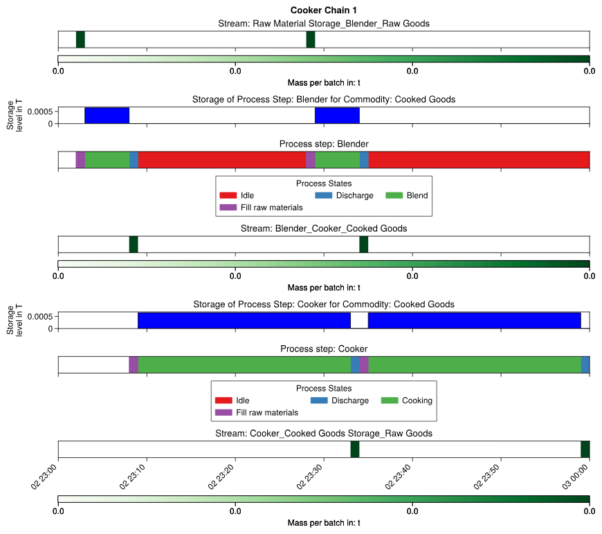
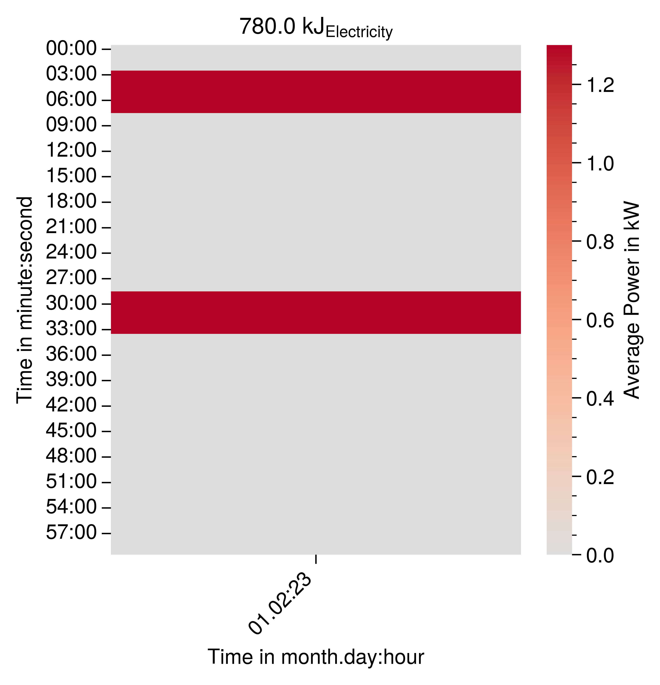
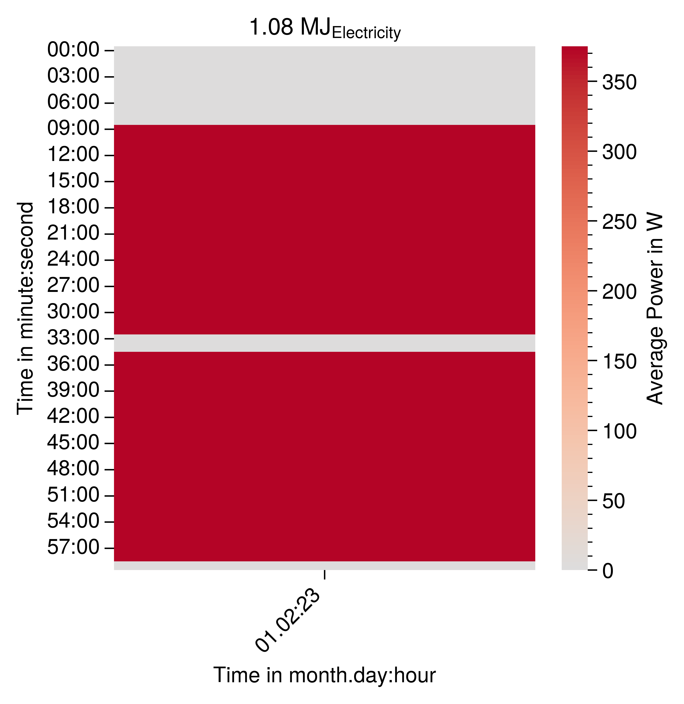
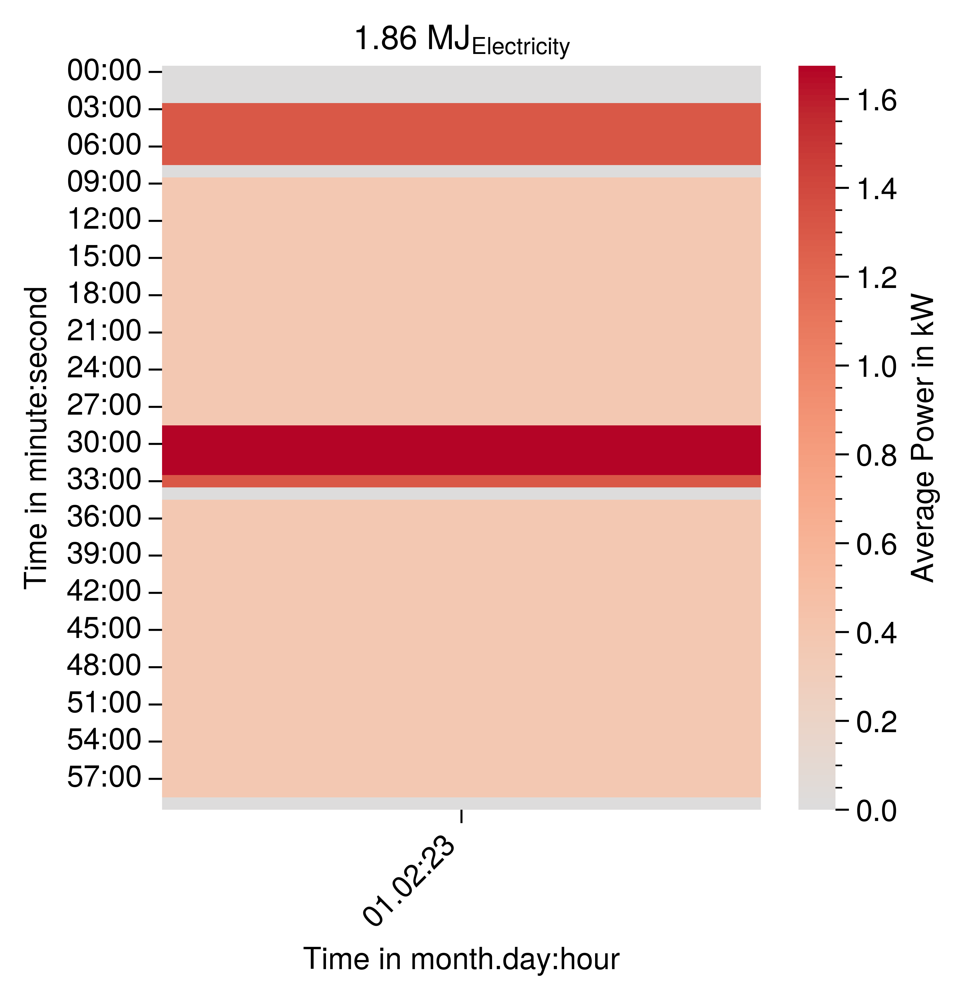

# Connect Two Process Steps Exclusively 
In order to connect two process steps sequentially they must be in the same process chain. This will be demonstrated by adding a blender prior to the cooker which is shown in {numref}`cooking-blender-exclusive-example`.

  
:::{figure-md} cooking-blender-exclusive-example


Depiction of the cooker model with two parallel cookers.
:::

## Add Additional Commodity

First additional commodities must be added for each of the new materials between source, process steps and sink.

```
raw_commodity = Commodity(name="Raw Goods")
uncooked_commodity = Commodity(name="Uncooked Goods")
output_commodity = Commodity(name="Cooked Goods")
```

## Create Both Process Steps
Both process steps must be created.
```
blender_step = process_chain.create_process_step(name="Blender")
cooker_step = process_chain.create_process_step(name="Cooker")
```

## Create Streams
Now streams are created to connect the source, both process steps and the sinks.
```
raw_materials_to_blender_stream = process_chain.stream_handler.create_batch_stream(
    batch_stream_static_data=BatchStreamStaticData(
        start_process_step_name=source.name,
        end_process_step_name=blender_step.name,
        delay=datetime.timedelta(minutes=1),
        commodity=raw_commodity,
        maximum_batch_mass_value=0.00065,
    )
)
blender_to_cooker_stream = process_chain.stream_handler.create_batch_stream(
    batch_stream_static_data=BatchStreamStaticData(
        start_process_step_name=blender_step.name,
        end_process_step_name=cooker_step.name,
        delay=datetime.timedelta(minutes=1),
        commodity=output_commodity,
        maximum_batch_mass_value=0.00065,
    )
)
cooker_to_sink_stream = process_chain.stream_handler.create_batch_stream(
    batch_stream_static_data=BatchStreamStaticData(
        start_process_step_name=cooker_step.name,
        end_process_step_name=sink.name,
        delay=datetime.timedelta(minutes=1),
        commodity=raw_commodity,
        maximum_batch_mass_value=0.00065,
    )
)
```
## Add Streams 
The streams that have the sink or source must be connected to the respective object explicitly.
```
source.add_output_stream(
    output_stream=raw_materials_to_blender_stream,
    process_chain_identifier=process_chain.process_chain_identifier,
)
sink.add_input_stream(
    input_stream=cooker_to_sink_stream,
    process_chain_identifier=process_chain.process_chain_identifier,
)
```

## Create Petri Nets for Each Process Step:

Now the petri net must be defined for each process step.
### Blender

The petri net for blender is similar to the one from cooker. It resembles a basic batch process with a continuous energy demand state between input and output. The major difference is that it is assumed to be much shorter.
```
activate_not_blending = blender_step.process_state_handler.process_state_switch_selector_handler.process_state_switch_handler.create_process_state_switch_at_next_discrete_event(
    start_process_state=discharge_goods_state_blender,
    end_process_state=idle_state_blender,
)
blender_step.process_state_handler.process_state_switch_selector_handler.create_single_choice_selector(
    process_state_switch=activate_not_blending
)

activate_filling_blender = blender_step.process_state_handler.process_state_switch_selector_handler.process_state_switch_handler.create_process_state_switch_at_input_stream(
    start_process_state=idle_state_blender,
    end_process_state=fill_raw_materials_state_1,
)

blender_step.process_state_handler.process_state_switch_selector_handler.create_single_choice_selector(
    process_state_switch=activate_filling_blender
)

activate_blending = blender_step.process_state_handler.process_state_switch_selector_handler.process_state_switch_handler.create_process_state_switch_delay(
    start_process_state=fill_raw_materials_state_1,
    end_process_state=blending_state,
    delay=datetime.timedelta(minutes=5),
)

blender_step.process_state_handler.process_state_switch_selector_handler.create_single_choice_selector(
    process_state_switch=activate_blending
)


activate_discharging_blender = blender_step.process_state_handler.process_state_switch_selector_handler.process_state_switch_handler.create_process_state_switch_at_output_stream(
    start_process_state=blending_state,
    end_process_state=discharge_goods_state_blender,
)
blender_step.process_state_handler.process_state_switch_selector_handler.create_single_choice_selector(
    process_state_switch=activate_discharging_blender
)
```

### Cooker

The cooker petri net is the same as in the first example.
```
idle_state_cooker = cooker_step.process_state_handler.create_idle_process_state(
    process_state_name="Idle"
)
fill_raw_materials_state_cooker = (
    cooker_step.process_state_handler.create_batch_input_stream_requesting_state(
        process_state_name="Fill raw materials"
    )
)

cooking_state = cooker_step.process_state_handler.create_intermediate_process_state_energy_based_on_stream_mass(
    process_state_name="Cooking"
)

discharge_goods_state_cooker = (
    cooker_step.process_state_handler.create_batch_output_stream_providing_state(
        process_state_name="Discharge"
    )
)


# Petri net transitions

activate_not_cooking = cooker_step.process_state_handler.process_state_switch_selector_handler.process_state_switch_handler.create_process_state_switch_at_next_discrete_event(
    start_process_state=discharge_goods_state_cooker,
    end_process_state=idle_state_cooker,
)
cooker_step.process_state_handler.process_state_switch_selector_handler.create_single_choice_selector(
    process_state_switch=activate_not_cooking
)

activate_filling_cooker = cooker_step.process_state_handler.process_state_switch_selector_handler.process_state_switch_handler.create_process_state_switch_at_input_stream(
    start_process_state=idle_state_cooker,
    end_process_state=fill_raw_materials_state_cooker,
)

cooker_step.process_state_handler.process_state_switch_selector_handler.create_single_choice_selector(
    process_state_switch=activate_filling_cooker
)

activate_cooking = cooker_step.process_state_handler.process_state_switch_selector_handler.process_state_switch_handler.create_process_state_switch_delay(
    start_process_state=fill_raw_materials_state_cooker,
    end_process_state=cooking_state,
    delay=datetime.timedelta(minutes=24),
)

cooker_step.process_state_handler.process_state_switch_selector_handler.create_single_choice_selector(
    process_state_switch=activate_cooking
)


activate_discharging_cooker = cooker_step.process_state_handler.process_state_switch_selector_handler.process_state_switch_handler.create_process_state_switch_at_output_stream(
    start_process_state=cooking_state,
    end_process_state=discharge_goods_state_cooker,
)
cooker_step.process_state_handler.process_state_switch_selector_handler.create_single_choice_selector(
    process_state_switch=activate_discharging_cooker
)
```

## Adapt Energy Data
Now the energy demand for the mixer must be added. It is assumed that the blending occurs for 5 minutes at a maximum power 1300 Watt for 650 gram of input material. Therefore the specific energy demand of the state is calculated as follows:

$$
SEC_{blending, state}=(P_{blend, max}*t_{blend, max})/m_{potato,water}=(2000W*5min)/(650 g)=600 MJ/t
$$

```
electricity_load = LoadType(name="Electricity")
mixing_state.create_process_state_energy_data_based_on_stream_mass(
    specific_energy_demand=600,
    load_type=electricity_load,
    stream=raw_materials_to_blender_stream,
)
cooking_state.create_process_state_energy_data_based_on_stream_mass(
    specific_energy_demand=830.76,
    load_type=electricity_load,
    stream=blender_to_cooker_stream,
)
```
## Add Mass Balances and Storages
The names of the streams and process steps must be adapted to the new variable names.

```
# Mass balances
blender_step.create_main_mass_balance(
    commodity=output_commodity,
    input_to_output_conversion_factor=1,
    main_input_stream=raw_materials_to_blender_stream,
    main_output_stream=blender_to_cooker_stream,
)

# Add internal storages (required)
blender_step.process_state_handler.process_step_data.main_mass_balance.create_storage(
    current_storage_level=0
)

# Mass balances
cooker_step.create_main_mass_balance(
    commodity=output_commodity,
    input_to_output_conversion_factor=1,
    main_input_stream=blender_to_cooker_stream,
    main_output_stream=cooker_to_sink_stream,
)

# Add internal storages (required)
cooker_step.process_state_handler.process_step_data.main_mass_balance.create_storage(
    current_storage_level=0
)
```

## Simulation Results

### Production Plan
{numref}`cooking-blender-exclusive-process-chain-gantt-chart` shows the production plan of the exclusively connected blender and cooker. It shows that the cooker fully occupied during the simulation. Whereas the blender is idle for a considerable time. This caused by the assumption that the blender requires a lot less time to blend the input stream for cooker. It has a higher capacity and could blend more material in the same time if it was requested from the cooker.

:::{figure-md} cooking-blender-exclusive-process-chain-gantt-chart


Gantt Chart of the production plan of the exclusively connected cooker and blender.
:::

### Load Profiles
{numref}`cooking-blender-exclusive-example-blender-carpet-plot` shows the carpet plot of the electricity load profile of the blender. It has short periods of high electricity consumptions which is caused by the overcapacity of the blender towards the cooker.   

:::{figure-md} cooking-blender-exclusive-example-blender-carpet-plot


Carpet plot of the electricity load profile of the blender.
:::

{numref}`cooking-blender-exclusive-example-cooker-carpet-plot` shows the electricity load profile carpet plot of the cooker. It is much more evenly distributed because the cooker operates at its maximum capacity. The electricity demand is only interrupted to charge and discharge the contents of the cooker. 

:::{figure-md} cooking-blender-exclusive-example-cooker-carpet-plot


Depiction of the cooker model with two parallel cookers.
:::

{numref}`cooking-blender-exclusive-example-electricity-combined` shows the carpet plot of the combined load profile of the cooker and blender. The fluctuations are caused by
- the asynchronous operation of the cooker and blender 
- the different energy demands of the operation sates of the blender and cooker
- the need to charge and discharge the blender and cooker
  
:::{figure-md} cooking-blender-exclusive-example-electricity-combined


Depiction of the cooker model with two parallel cookers.
:::

In the next example shows how to connect three or more process steps non exclusively.