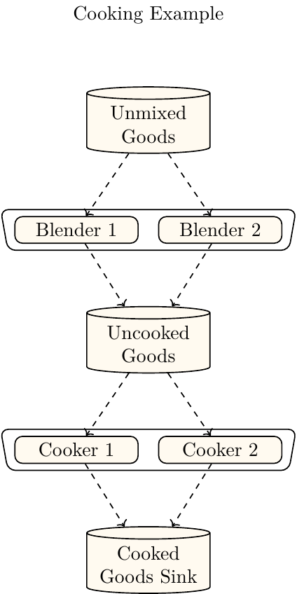
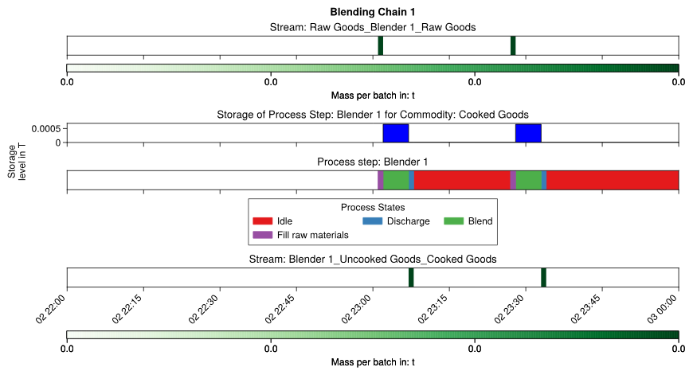
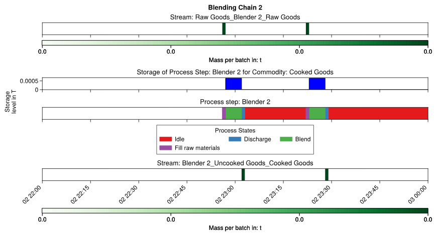
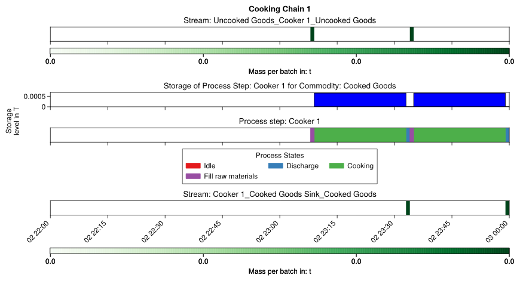
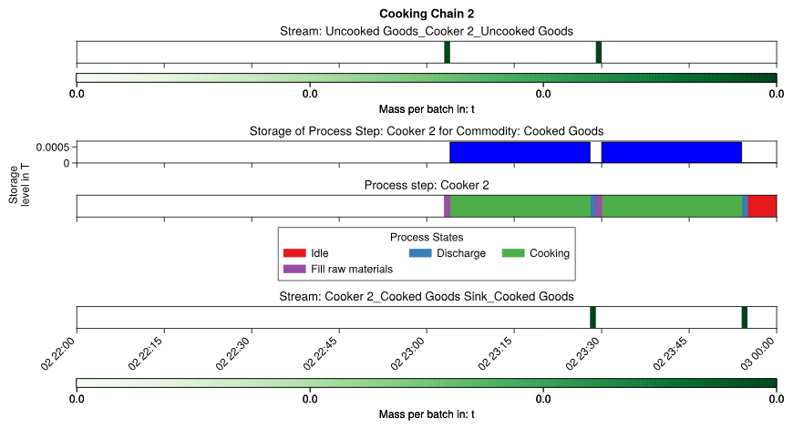
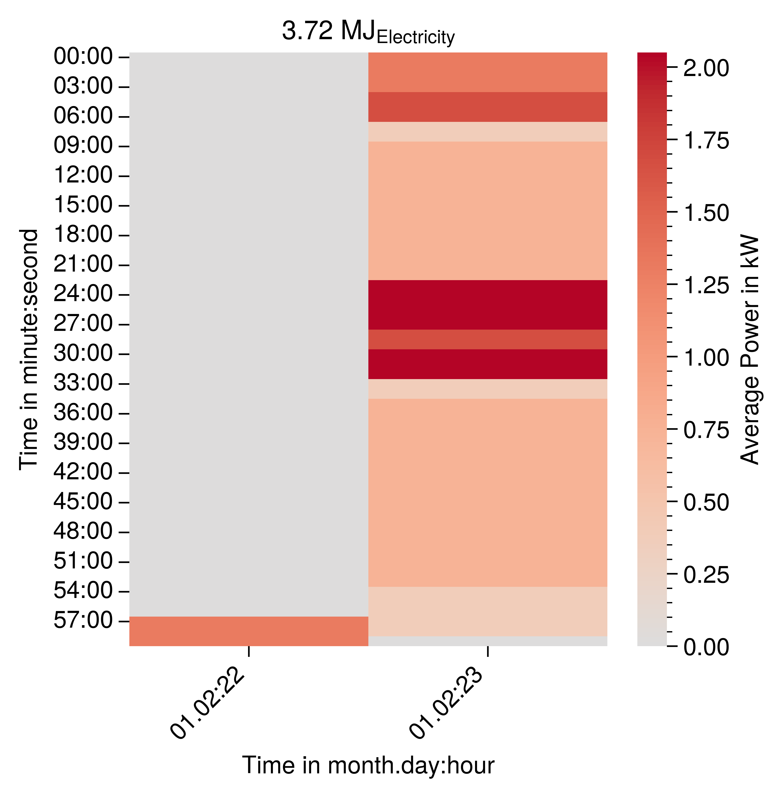

# Connect Three or More Process Steps

In order to connect three or more process steps two network levels are required. In this example two blenders are connected to two cookers which are shown in figure {numref}`two-cooker-two-blender-example`. The process steps are connected through the storage which connects the two network levels. It replaces the sink the upper network level and the source of the lower network level. It distributes the outputs of both blenders to the inputs of both cookers evenly. 

:::{figure-md} two-cooker-two-blender-example


Depiction of the cooker model with two two cooker and two blender.
:::

To prevent repetition the model is distributed between three python modules. The module simulation_starter.py contains the definition of the time data, commodities, enterprise, network level, process chains, sources, sinks and storages. The required objects of process chains instantiated using a function which can be applied to each process chain object in a network level. The function for each network level is located in their own module. These functions are called fill_blending_process_chain and fill_cooking_process_chain. By calling these functions multiple times an arbitrary number of process chains can be instantiated easily.

## simulation_starter.py
This section shows the contents of the simulation_starter.py module.
### Create Time Data and Orders
First the commodities, time data and orders are created. Each process chain needs at least one order to start the simulation.
```
# Set simulation time data
start_date = datetime.datetime(2022, 1, 2, hour=22, minute=30)
end_date = datetime.datetime(2022, 1, 3)
time_data = TimeData(
    global_start_date=start_date,
    global_end_date=end_date,
)

# Determine all relevant commodities
raw_commodity = Commodity(name="Raw Goods")
uncooked_commodity = Commodity(name="Uncooked Goods")
output_commodity = Commodity(name="Cooked Goods")

# Create all order for the simulation
order_generator = NOrderGenerator(
    commodity=output_commodity,
    mass_per_order=0.00065,
    production_deadline=end_date,
    number_of_orders=4,
)

order_collection = order_generator.create_n_order_collection()
```
### Create Enterprise, Network Level and Process Chains
In the next step the enterprise, network level and process chains are created.
```
cooking_network_level = enterprise.create_network_level()
blending_network_level = enterprise.create_network_level()

blending_chain_1 = blending_network_level.create_process_chain("Blending Chain 1")
blending_chain_2 = blending_network_level.create_process_chain("Blending Chain 2")

cooking_chain_1 = cooking_network_level.create_process_chain("Cooking Chain 1")
cooking_chain_2 = cooking_network_level.create_process_chain("Cooking Chain 2")
```

### Create and Connect Source, Sink and  Process Chain Storage 
The source and sink are created by their respective network level. The storage is created by network level which replaces a source with it. Here it is the cooking network level. The storage is then passed to the upper blender network level as a sink. Afterwards the sink, source and storages must be added to their respective process chain.

```
cooked_goods_sink = cooking_network_level.create_main_sink(
    name="Cooked Goods Sink",
    commodity=cooked_commodity,
    order_collection=order_collection,
)

uncooked_goods_storage = cooking_network_level.create_process_chain_storage_as_source(
    name="Uncooked Goods", commodity=uncooked_commodity
)
raw_goods_source = blending_network_level.create_main_source(
    "Raw Goods", commodity=raw_commodity
)
blending_network_level.add_process_chain_storage_as_sink(
    process_chain_storage=uncooked_goods_storage
)

blending_chain_1.add_sink(sink=uncooked_goods_storage)
blending_chain_2.add_sink(sink=uncooked_goods_storage)
blending_chain_1.add_source(source=raw_goods_source)
blending_chain_2.add_source(source=raw_goods_source)
cooking_chain_1.add_sink(sink=cooked_goods_sink)
cooking_chain_1.add_source(source=uncooked_goods_storage)
cooking_chain_2.add_sink(sink=cooked_goods_sink)
cooking_chain_2.add_source(source=uncooked_goods_storage)
```

## Call Function to Fill Process Chains With Content
In the next step the contents of the process chains are created by calls to the respective fill function.  They are called as follows in the simulation_starter.py module:
```
from blending_process_chain import (
    fill_blending_process_chain,
)
from cooking_process_chain import (
    fill_cooking_process_chain,
)
fill_cooking_process_chain(
    process_chain=cooking_chain_1,
    uncooked_commodity=uncooked_commodity,
    cooked_commodity=cooked_commodity,
    cooked_goods_sink=cooked_goods_sink,
    uncooked_goods_storage=uncooked_goods_storage,
    process_step_name="Cooker 1",
)
fill_cooking_process_chain(
    process_chain=cooking_chain_2,
    uncooked_commodity=uncooked_commodity,
    cooked_commodity=cooked_commodity,
    cooked_goods_sink=cooked_goods_sink,
    uncooked_goods_storage=uncooked_goods_storage,
    process_step_name="Cooker 2",
)

fill_blending_process_chain(
    process_chain=blending_chain_1,
    raw_commodity=raw_commodity,
    cooked_commodity=cooked_commodity,
    raw_goods_source=raw_goods_source,
    uncooked_storage=uncooked_goods_storage,
    process_step_name="Blender 1",
)
fill_blending_process_chain(
    process_chain=blending_chain_2,
    raw_commodity=raw_commodity,
    cooked_commodity=cooked_commodity,
    raw_goods_source=raw_goods_source,
    uncooked_storage=uncooked_goods_storage,
    process_step_name="Blender 2",
)
```

### Start the Simulation and Postprocessing

Lastly the simulation and post processing is started.

```
# Start the simulation
enterprise.start_simulation(number_of_iterations_in_chain=200)

# Create report of the simulation results
enterprise.create_post_simulation_report(
    start_date=start_date,
    end_date=end_date,
    x_axis_time_delta=datetime.timedelta(hours=1),
    resample_frequency="5min",
    gantt_chart_end_date=end_date,
    gantt_chart_start_date=start_date,
)
```
## Fill Blender Process Chain
Now the definition of the functions that fill the process chains are shown. The function is located in the blending_process_chain.py module.

### Pass Process Chain, Commodity and Process Step Name 
First the process chain instance and the commodities, source and storage which are shared among process chains are passed to the fill function.
```
def fill_blending_process_chain(
    process_chain: ProcessChain,
    raw_commodity: Commodity,
    cooked_commodity: Commodity,
    uncooked_storage: ProcessChainStorage,
    raw_goods_source: Source,
    process_step_name: str,
):
```
### Create Process Step and Streams
Then process steps and streams are created. The only difference is that the argument from the functions are used for the process chain, process step name and commodities.
```
    # Create Process nodes
    blender_step = process_chain.create_process_step(name=process_step_name)

    # Streams
    ## Process Chain 1
    raw_materials_to_cooking_stream = process_chain.stream_handler.create_batch_stream(
        batch_stream_static_data=BatchStreamStaticData(
            start_process_step_name=raw_goods_source.name,
            end_process_step_name=blender_step.name,
            delay=datetime.timedelta(minutes=1),
            commodity=raw_commodity,
            maximum_batch_mass_value=0.00065,
        )
    )
    cooking_to_sink_stream = process_chain.stream_handler.create_batch_stream(
        batch_stream_static_data=BatchStreamStaticData(
            start_process_step_name=blender_step.name,
            end_process_step_name=uncooked_storage.name,
            delay=datetime.timedelta(minutes=1),
            commodity=cooked_commodity,
            maximum_batch_mass_value=0.00065,
        )
    )
```
### Define Petri Net of States
The petri nets of the blender are defined as in the [example in which the blender was introduced](4_connect_two_process_steps_exclusively.md).
```
    idle_state = blender_step.process_state_handler.create_idle_process_state(
        process_state_name="Idle"
    )
    fill_raw_materials_state = (
        blender_step.process_state_handler.create_batch_input_stream_requesting_state(
            process_state_name="Fill raw materials"
        )
    )

    blender_state = blender_step.process_state_handler.create_intermediate_process_state_energy_based_on_stream_mass(
        process_state_name="Mix"
    )

    discharge_goods_state_blender = (
        blender_step.process_state_handler.create_batch_output_stream_providing_state(
            process_state_name="Discharge"
        )
    )

    # Petri net transitions

    activate_not_blending = blender_step.process_state_handler.process_state_switch_selector_handler.process_state_switch_handler.create_process_state_switch_at_next_discrete_event(
        start_process_state=discharge_goods_state_blender,
        end_process_state=idle_state,
    )
    blender_step.process_state_handler.process_state_switch_selector_handler.create_single_choice_selector(
        process_state_switch=activate_not_blending
    )

    activate_filling_blender = blender_step.process_state_handler.process_state_switch_selector_handler.process_state_switch_handler.create_process_state_switch_at_input_stream(
        start_process_state=idle_state,
        end_process_state=fill_raw_materials_state,
    )

    blender_step.process_state_handler.process_state_switch_selector_handler.create_single_choice_selector(
        process_state_switch=activate_filling_blender
    )

    activate_blender = blender_step.process_state_handler.process_state_switch_selector_handler.process_state_switch_handler.create_process_state_switch_delay(
        start_process_state=fill_raw_materials_state,
        end_process_state=blender_state,
        delay=datetime.timedelta(minutes=5),
    )

    blender_step.process_state_handler.process_state_switch_selector_handler.create_single_choice_selector(
        process_state_switch=activate_blender
    )

    activate_discharging_blender = blender_step.process_state_handler.process_state_switch_selector_handler.process_state_switch_handler.create_process_state_switch_at_output_stream(
        start_process_state=blender_state,
        end_process_state=discharge_goods_state_blender,
    )
    blender_step.process_state_handler.process_state_switch_selector_handler.create_single_choice_selector(
        process_state_switch=activate_discharging_blender
    )
```
### Add Energy Data
The energy data  did not change in comparison to the previous example.
```
    electricity_load = LoadType(name="Electricity")
    blender_state.create_process_state_energy_data_based_on_stream_mass(
        specific_energy_demand=600,
        load_type=electricity_load,
        stream=raw_materials_to_cooking_stream,
    )
```

### Add Mass Balance and Storage
Also the mass balance and storage do not change compared to the minimal example. 
```
    # Mass balances
    blender_step.create_main_mass_balance(
        commodity=cooked_commodity,
        input_to_output_conversion_factor=1,
        main_input_stream=raw_materials_to_cooking_stream,
        main_output_stream=cooking_to_sink_stream,
    )

    # Add internal storages (required)
    blender_step.process_state_handler.process_step_data.main_mass_balance.create_storage(
        current_storage_level=0
    )
```

## Fill Cooking Process Chain
The fill cooking process chain function is very similar to the fill blender process chain function. It differs mainly in the arguments that are passed to it, the petri net and the energy data. However the petri net and energy data did not change compared to the [example](4_connect_two_process_steps_exclusively.md) in which the blender was introduced.

### Pass process Chain, Commodity and Process Step Name 
The first argument is the process chain in which the cooker should be initiated. The commodities are the input and output commodity of the cooker. The sink and storage are required to connect it to the streams in the process chain. The process step name is required to distinguish the process steps from each other. 
```
def fill_cooking_process_chain(
    process_chain: ProcessChain,
    uncooked_commodity: Commodity,
    cooked_commodity: Commodity,
    cooked_goods_sink: Sink,
    uncooked_goods_storage: ProcessChainStorage,
    process_step_name: str,
):
```

### Create Process Step and Streams
Then the process step and streams are created. Then the streams are connected.
```
    raw_materials_to_cooking_stream = process_chain.stream_handler.create_batch_stream(
        batch_stream_static_data=BatchStreamStaticData(
            start_process_step_name=uncooked_goods_storage.name,
            end_process_step_name=process_step.name,
            delay=datetime.timedelta(minutes=1),
            commodity=uncooked_commodity,
            maximum_batch_mass_value=0.00065,
        )
    )
    cooking_to_sink_stream = process_chain.stream_handler.create_batch_stream(
        batch_stream_static_data=BatchStreamStaticData(
            start_process_step_name=process_step.name,
            end_process_step_name=cooked_goods_sink.name,
            delay=datetime.timedelta(minutes=1),
            commodity=cooked_commodity,
            maximum_batch_mass_value=0.00065,
        )
    )

    # Add streams to sinks and sources
    uncooked_goods_storage.add_output_stream(
        output_stream=raw_materials_to_cooking_stream,
        process_chain_identifier=process_chain.process_chain_identifier,
    )
    cooked_goods_sink.add_input_stream(
        input_stream=cooking_to_sink_stream,
        process_chain_identifier=process_chain.process_chain_identifier,
    )
```
### Define Petri Net of States

The Petri net did not change compared to the definition in the [single cooker example](1_single_cooker_process_chain.md).

```
    idle_state = process_step.process_state_handler.create_idle_process_state(
        process_state_name="Idle"
    )
    fill_raw_materials_state = (
        process_step.process_state_handler.create_batch_input_stream_requesting_state(
            process_state_name="Fill raw materials"
        )
    )

    cooking_state = process_step.process_state_handler.create_intermediate_process_state_energy_based_on_stream_mass(
        process_state_name="Cooking"
    )

    discharge_goods_state = (
        process_step.process_state_handler.create_batch_output_stream_providing_state(
            process_state_name="Discharge"
        )
    )

    # Petri net transitions

    activate_not_cooking = process_step.process_state_handler.process_state_switch_selector_handler.process_state_switch_handler.create_process_state_switch_at_next_discrete_event(
        start_process_state=discharge_goods_state,
        end_process_state=idle_state,
    )
    process_step.process_state_handler.process_state_switch_selector_handler.create_single_choice_selector(
        process_state_switch=activate_not_cooking
    )

    activate_filling = process_step.process_state_handler.process_state_switch_selector_handler.process_state_switch_handler.create_process_state_switch_at_input_stream(
        start_process_state=idle_state,
        end_process_state=fill_raw_materials_state,
    )

    process_step.process_state_handler.process_state_switch_selector_handler.create_single_choice_selector(
        process_state_switch=activate_filling
    )

    activate_cooking = process_step.process_state_handler.process_state_switch_selector_handler.process_state_switch_handler.create_process_state_switch_delay(
        start_process_state=fill_raw_materials_state,
        end_process_state=cooking_state,
        delay=datetime.timedelta(minutes=24),
    )

    process_step.process_state_handler.process_state_switch_selector_handler.create_single_choice_selector(
        process_state_switch=activate_cooking
    )

    activate_discharging = process_step.process_state_handler.process_state_switch_selector_handler.process_state_switch_handler.create_process_state_switch_at_output_stream(
        start_process_state=cooking_state,
        end_process_state=discharge_goods_state,
    )
    process_step.process_state_handler.process_state_switch_selector_handler.create_single_choice_selector(
        process_state_switch=activate_discharging
    )
```
### Add Energy Data

The energy data did also not change to the initial example.
```
    electricity_load = LoadType(name="Electricity")
    mixing_state.create_process_state_energy_data_based_on_stream_mass(
        specific_energy_demand=600,
        load_type=electricity_load,
        stream=raw_materials_to_cooking_stream,
    )

    # Mass balances
    mixer_step.create_main_mass_balance(
        commodity=cooked_commodity,
        input_to_output_conversion_factor=1,
        main_input_stream=raw_materials_to_cooking_stream,
        main_output_stream=cooking_to_sink_stream,
    )
```

### Create Mass Balance and Storage 
The mass balance and storage did not change compared to the previous example of the cooker.
```
    # Mass balances
    mixer_step.create_main_mass_balance(
        commodity=cooked_commodity,
        input_to_output_conversion_factor=1,
        main_input_stream=raw_materials_to_cooking_stream,
        main_output_stream=cooking_to_sink_stream,
    )

    # Add internal storages (required)
    mixer_step.process_state_handler.process_step_data.main_mass_balance.create_storage(
        current_storage_level=0
    )
```
## Simulation Results

The following section shows the simulation results.
### Production Plan

{numref}`blender-1-nxm-example-process-chain-gantt-chart`  and {numref}`blender-2-nxm-example-process-chain-gantt-chart` show a gantt chart of the blender 1 and blender 2. They are shifted slightly due to the shifted input orders.

:::{figure-md} blender-1-nxm-example-process-chain-gantt-chart


Gantt Chart of the production plan of the exclusively connected cooker and blender.
:::

:::{figure-md} blender-2-nxm-example-process-chain-gantt-chart


Carpet plot of the electricity load profile of the blender.
:::


{numref}`cooker-1-nxm-example-process-chain-gantt-chart`  and {numref}`cooker-2-nxm-example-process-chain-gantt-chart` show a gantt chart of the cooker 1 and cooker 2. They are shifted slightly due to the shifted input orders.

:::{figure-md} cooker-1-nxm-example-process-chain-gantt-chart


Depiction of the cooker model with two parallel cookers.
:::

:::{figure-md} cooker-2-nxm-example-process-chain-gantt-chart


Depiction of the cooker model with two parallel cookers.
:::

### Load Profiles

Figure {numref}`nxm-example-electricity-combined` shows the carpet plot of the combined load profile of both cookers and both blenders. Due to higher number of process steps a more complex load profile can be seen. This is caused by the increased possibilities for asynchronous operations. 
  
:::{figure-md} nxm-example-electricity-combined


Depiction of the cooker model with two parallel cookers.
:::