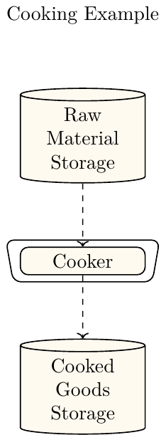

# Simple Cooker Example

This section shows how to setup a minimal simulation of a production system that simulates a single cooker. A depiction of the ETHOS.PeNALPS Model is shown in figure {numref}`cooking-example-single`. The energy, time and mass data is used from an experiment by {cite}`Korzeniowska_Ginter_2019`. Korzeniowska-Ginter et al . conducted a series of experiments to determine cooking length and energy of potatoes demand using household appliances. For this case the data from the electric stove with a metal plate is used. 

:::{figure-md} cooking-example-single


Depiction of the minimal production system model in ETHOS.PeNALPS which simulates a simple cooker.
:::

## Initialize Time Data
The first step is to setup the desired simulation period. The start time is only relevant for the period displayed. The simulation starts internally at the end date and terminates when all orders are created, which is shown in the following section.

```
import datetime
from ethos_penalps.time_data import TimeData

start_date = datetime.datetime(2022, 1, 2, hour=22, minute=30)
end_date = datetime.datetime(2022, 1, 3)
time_data = TimeData(
    global_start_date=start_date,
    global_end_date=end_date,
)
```

## Setup All Commodities
The second step is create all commodities which represent raw materials, intermediate products or final products of the production system. The modelled energy types and carriers for the load profiles are modelled later.

```
from ethos_penalps.data_classes import Commodity
# Determine all relevant commodities
output_commodity = Commodity(name="Cooked Goods")
input_commodity = Commodity(name="Raw Goods")
```
## Create Product Orders 
As a third step the orders to be produced during the simulation must be created. The mass is passed as metric tones. The order consists of the commodity of the product, the deadline and the number of orders. The simulation attempts to fulfill the order just in time. If it is not possible due to capacity constraints, the production start is shifted to an earlier time. The order size is based on the mass that was used in a single experiment which consists of 200 gram potatoes and 450 ml of water. {cite}`Korzeniowska_Ginter_2019` p.3

```
# Create all order for the simulation
order_generator = NOrderGenerator(
    commodity=output_commodity,
    mass_per_order=0.00065,
    production_deadline=end_date,
    number_of_orders=2,
)
order_collection = order_generator.create_n_order_collection()
```
## Create Container Classes
The fourth step is to provide the minimum set of container classes. This consists of 
- an enterprise object
- a network level
- a process chain. 

These become relevant when multiple process steps should be modeled in a production system. [This is discussed in a later part of the tutorial](add_network_level_and_process_chains.md). It is important that the respective creator methods must be used as shown in this example. If the network level and process chain are instantiated directly from the class they are not connected properly.

```
from ethos_penalps.enterprise import Enterprise

enterprise = Enterprise(time_data=time_data, name="Cooking Example")
network_level = enterprise.create_network_level()
process_chain = network_level.create_process_chain(process_chain_name="Cooker Chain")
```
## Create Source, Sink and Process Step
In the next step source, sink and process step are created. The sink and source connect the production system to environment. The sink collects the requested products and the source provides the required raw materials. Additionally, the sink and source must be connected to process chain.

```
# Create all sources, sinks and network level storages
sink = network_level.create_main_sink(
    name="Cooked Goods Storage",
    commodity=output_commodity,
    order_collection=order_collection,
)
source = network_level.create_main_source(
    name="Raw Material Storage",
    commodity=input_commodity,
)
process_chain.add_sink(sink=continuous_sink)
process_chain.add_source(source=batch_source)
```

Now the actual process step is created. 

```
process_step = process_chain.create_process_step(name="Process Step")
```

## Create Streams, Sink, Source and Process Step
The source, sink and process step must be connected by streams. These determine the material flow direction:

```
import datetime
raw_materials_to_cooking_stream = process_chain.stream_handler.create_batch_stream(
    batch_stream_static_data=BatchStreamStaticData(
        start_process_step_name=source.name,
        end_process_step_name=process_step.name,
        delay=datetime.timedelta(minutes=1),
        commodity=input_commodity,
        maximum_batch_mass_value=0.00065,
    )
)
cooking_to_sink_stream = process_chain.stream_handler.create_batch_stream(
    batch_stream_static_data=BatchStreamStaticData(
        start_process_step_name=process_step.name,
        end_process_step_name=sink.name,
        delay=datetime.timedelta(minutes=1),
        commodity=output_commodity,
        maximum_batch_mass_value=0.00065,
    )
)

source.add_output_stream(
    output_stream=raw_materials_to_cooking_stream,
    process_chain_identifier=process_chain.process_chain_identifier,
)
sink.add_input_stream(
    input_stream=cooking_to_sink_stream,
    process_chain_identifier=process_chain.process_chain_identifier,
)
```
## Create Petri Net of States
The behavior of the process step during the production is determined by a petri net of states. All possible states of the process step are modelled by a node of the petri net.
These must be connected by transitions. 

### Create Nodes
The simplest combination consists of an idle state and either a combined input and output state or two separate input and output states. In this case the model consists of:

- idle state
- input state
- output state
- intermediate state 

The intermediate state is not necessary to run the simulation, but is used to model the cooking phase of the cooking process. The input and output the states model the time phase in which input and output commodities are loaded or discharged.

```
idle_state = process_step.process_state_handler.create_idle_process_state(
    process_state_name="Idle"
)
fill_raw_materials_state = (
    process_step.process_state_handler.create_batch_input_stream_requesting_state(
        process_state_name="Fill raw materials"
    )
)

cooking_state = process_step.process_state_handler.create_intermediate_process_state_energy_based_on_stream_mass(
    process_state_name="Cooking"
)

discharge_goods_state = (
    process_step.process_state_handler.create_batch_output_stream_providing_state(
        process_state_name="Discharge"
    )
)
```

### Create Transitions
The transitions connect the newly created nodes. The transitions are called process state switches. In order to understand how the switches and states are connected it is important to note that the internal transition are conducted in reversed time direction. Thus, the condition is evaluated at the end process state. Currently there are four process state switches implemented which should be connected to the following end state:

1. switch_at_next_discrete_event -> idle_state
2. process_state_switch_at_input_stream -> input_state
3. process_state_switch_at_output_stream --> output_state
4. create_process_state_switch_delay --> intermediate_state

Additionally, selectors are implemented to determine which transition are evaluated when multiple transitions could occur in the same state. In this example each state only has a single transition. Thus, the process state switch is passed to a so called single choice selector. The cooking time is assumed to be 24 minutes in total. {cite}`Korzeniowska_Ginter_2019` p.5

```
activate_not_cooking = process_step.process_state_handler.process_state_switch_selector_handler.process_state_switch_handler.create_process_state_switch_at_next_discrete_event(
    start_process_state=discharge_goods_state,
    end_process_state=idle_state,
)
process_step.process_state_handler.process_state_switch_selector_handler.create_single_choice_selector(
    process_state_switch=activate_not_cooking
)

activate_filling = process_step.process_state_handler.process_state_switch_selector_handler.process_state_switch_handler.create_process_state_switch_at_input_stream(
    start_process_state=idle_state,
    end_process_state=fill_raw_materials_state,
)

process_step.process_state_handler.process_state_switch_selector_handler.create_single_choice_selector(
    process_state_switch=activate_filling
)

activate_cooking = process_step.process_state_handler.process_state_switch_selector_handler.process_state_switch_handler.create_process_state_switch_delay(
    start_process_state=fill_raw_materials_state,
    end_process_state=cooking_state,
    delay=datetime.timedelta(minutes=24),
)

process_step.process_state_handler.process_state_switch_selector_handler.create_single_choice_selector(
    process_state_switch=activate_cooking
)


activate_discharging = process_step.process_state_handler.process_state_switch_selector_handler.process_state_switch_handler.create_process_state_switch_at_output_stream(
    start_process_state=cooking_state,
    end_process_state=discharge_goods_state,
)
process_step.process_state_handler.process_state_switch_selector_handler.create_single_choice_selector(
    process_state_switch=activate_discharging
)
```
## Initialize Energy Data

Finally the energy data must be initialized. Therefore, the energy load type must be initialized, which is electricity in this example. It can either be addressed to a specific state or to the activity of a stream. Here the complete energy is consumed during the cooking state. The specific energy demand is provided in the units MJ/t. An energy demand of 830.76 MJ/t is assumed it is based on the energy demand of 0.15 kWh/650 gram {cite}`Korzeniowska_Ginter_2019` p.5  The input stream of the corresponding process step must be passed to the energy data to determine the mass that is processed in the state.

```
electricity_load = LoadType(name="Electricity")
cooking_state.create_process_state_energy_data_based_on_stream_mass(
    specific_energy_demand=830.76,
    load_type=electricity_load,
    stream=raw_materials_to_cooking_stream,
)
```

## Create Internal Storages and Mass Balances

The last step before the simulation is to create mass balances and storages for each process step, which are required to start the simulation. These are used to model input to output conversions of the process step. They are mainly used for the internal processing of the output and input streams during the simulation.

```
process_step.create_main_mass_balance(
    commodity=output_commodity,
    input_to_output_conversion_factor=1,
    main_input_stream=raw_materials_to_cooking_stream,
    main_output_stream=cooking_to_sink_stream,
)

process_step.process_state_handler.process_step_data.main_mass_balance.create_storage(
    current_storage_level=0
)
```
## Start Simulation and Post Processing

Lastly, the simulation and post processing must be started. Optionally, a maximum number of internal iterations can be determined to terminate ill defined simulations. The create_post_simulation_report method creates an HTML report of the simulation results. It contains:
- A figure of the modelled process
- The production plan 
  - Table
  - downloadable CSV file
- Load Profiles 
  - Table
  - downloadable CSV file
- Gantt chart of streams, process steps, sink and source
- A carpet plot of the load profiles

```
enterprise.start_simulation(number_of_iterations_in_chain=200)
enterprise.create_post_simulation_report(
    start_date=start_date,
    end_date=end_date,
    x_axis_time_delta=datetime.timedelta(hours=1),
    resample_frequency="5min",
    gantt_chart_end_date=end_date,
    gantt_chart_start_date=start_date,
)
```

The next sections shows how the cooking process can be modelled in greater detail.