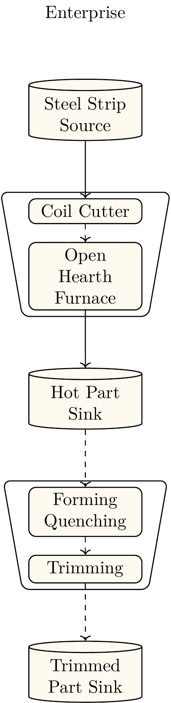

# Example: B-Pillar Production 
This example is based on the process description in {cite}`Neugebauer.2012` . It is for demonstration of the capabilities of EHTOS.PeNALPS and the results are not validated yet. [Figure 1](process_chain_visualization)
shows the process which consists of the following 4 steps:
1. Blanking
2. Heating
3. Forming and quenching
4. Trimming


:::{figure-md} process_chain_visualization


Direct Press hardening process chain {cite}`MezaGarcia.2019`
:::

The model built from this description is shown in [Figure 2](process_network_model_b_pillar).

:::{figure-md} process_network_model_b_pillar


Direct Press hardening process chain {cite}`Neugebauer.2012`
:::

# Capacity
The material flow parameters are determined based on the weight of a single b-pillar and the turnover times of the Forming and quenching.

It is assumed that the B-Pillar has a weight of 6kg. This assumption is based on the reported weight of a standard design in {cite}`Pan.2010` which was 5.21 kg

The turnover times are used from {cite}`MezaGarcia.2019` . The transfer from the oven takes 6 seconds and the press hardening 30 seconds

It is assumed that transfer from the forming and quenching step also takes 6 seconds. This sums up to to a turnover time of 42 seconds. This leads to capacity of 6 kg/42 seconds or 0.51 t / h


It is assumed that the other machines have the capacity to allow continuous production

# Energy Demand

Meza-García et. al. provides theoretical energies for 300 seconds of operation. 

- E_theo,heating = 1867 kWs
- E_theo,forming = 17503 kWs

These are converted to real energies using the provided efficiency of 0.22:

- E_real,heating = 8.44 MJ
- E_real,forming = 79.559 MJ

Because these values are provided for 300 seconds of operation, they muss be converted to be mass specific to the product.
The specific energy demands are calculated by 

E_heating_mass= E_real,heating/(300 s * 0.51 t/h)=198.61 MJ/t
E_forming_mass= E_real,forming/(300 s * 0.51 t/h)=1871.98 MJ/t


For blanking and trimming no energy values are provided thus they are assumed to be:

- E_real,blanking = 0.2 * E_forming_mass= 374.396 MJ/t
- E_real,trimming = 0.3 * E_forming_mass = 561.594 MJ/t


```{bibliography}
```