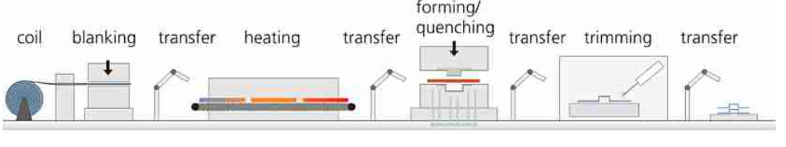
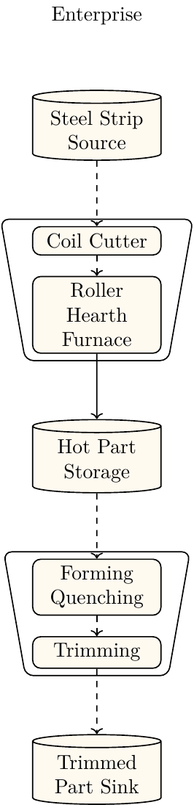
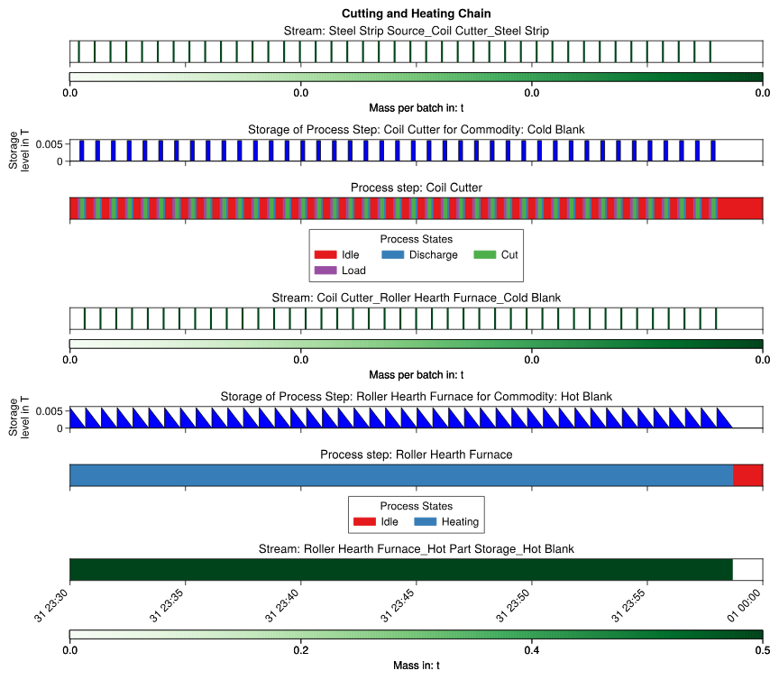
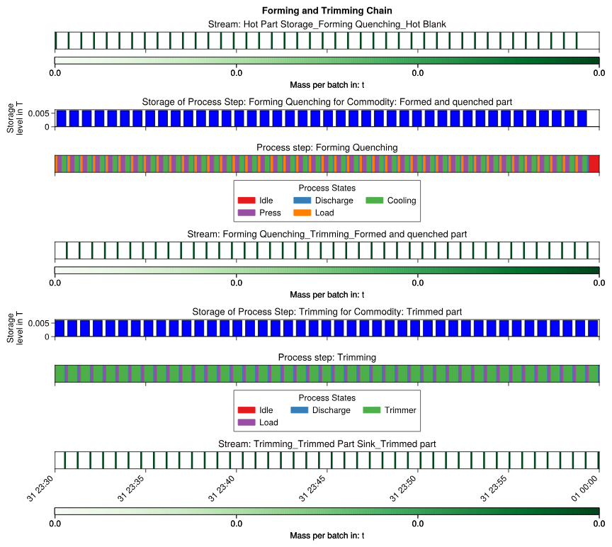
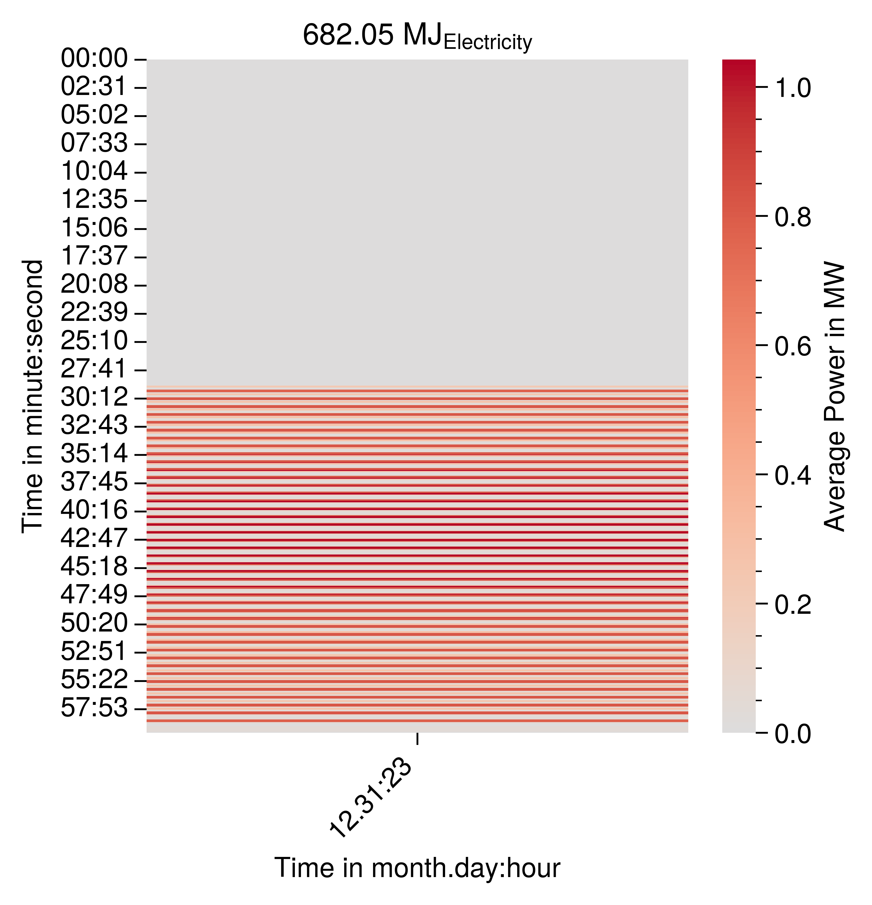

# Example: B-Pillar Production 
This example is based on the process description in {cite}`Neugebauer.2012`. It demonstrates the capabilities of ETHOS.PeNALPS and the results are not validated yet. {numref}`process_chain_visualization` 
shows schematic of the process which consists of the following 4 steps:
1. Blanking
2. Heating
3. Forming and quenching
4. Trimming

:::{figure-md} process_chain_visualization

Direct Press hardening process chain {cite}`MezaGarcia.2019` 
:::

{numref}`process_network_model_b_pillar` shows the ETHOS.PeNALPS model built from the description shown in [Figure 2](process_network_model_b_pillar).

:::{figure-md} process_network_model_b_pillar

Flow Chart of direct press hardening production network.
:::

# Capacity
The material flow parameters are determined based on the weight of a single b-pillar and the turnover times of the Forming and quenching. It is assumed that the B-Pillar has a weight of 6kg. This assumption is based on the reported weight of a standard design in {cite}`Pan.2010` which was 5.21 kg. The turnover times are used from {cite}`MezaGarcia.2019` . The transfer from the oven takes 6 seconds and the press hardening 30 seconds. It is assumed that transfer from the forming and quenching step also takes 6 seconds. This sums up to to a turnover time of 42 seconds. This leads to capacity of $6 kg/42 seconds$ or $0.51 t / h$. It is assumed that the other machines have the capacities to allow continuous production.

# Energy Demand

Meza-García et. al. {cite}`MezaGarcia.2019` provides theoretical energies for 300 seconds of operation. 

$$
E_{theo, heating} = 1867 kWs
$$
$$
E_{theo,forming} = 17503 kWs
$$

These are converted to real energies using the provided efficiency of 0.22:

$$
E_{real,heating} = 8.44 MJ
$$
$$
E_{real,forming} = 79.559 MJ
$$

Because these values are provided for 300 seconds of operation, they muss be converted to be mass specific to the product.
The specific energy demands are calculated by 

$$
E_{heating_mass}= \frac{E_{real,heating}}{300 s * 0.51 t/h}=198.61 MJ/t
$$
$$
E_{forming_mass}= \frac{E_{real,forming}}{300 s * 0.51 t/h}=1871.98 MJ/t
$$

For blanking and trimming no energy values are provided thus they are assumed to be:

$$
E_{real,blanking} = 0.2 * E_{forming_mass}= 374.396 MJ/t
$$
$$
E_{real,trimming} = 0.3 * E_{forming_mass} = 561.594 MJ/t
$$

# Simulation Results
## Production Plan

{numref}`cutting-and-open-roller-furnace-gantt-chart` shows the Gantt Chart of the process chain that contains the cutting machine and the open roller furnace. The cutter is idle most of the time because the cutting requires less time than the heating process.
The open roller furnace operates continuously.

:::{figure-md} cutting-and-open-roller-furnace-gantt-chart

Gantt chart of the cutter and open roller furnace. It shows the sequential operation states of each machine and how their inputs and outputs depend on each other.
:::

{numref}`forming-and-quenching-gantt-chart` shows the Gantt Chart of forming and quenching machine as well as the trimming machine.

:::{figure-md} forming-and-quenching-gantt-chart

Gantt chart of the forming and quenching machine and the trimming machine.
:::

## Load Profiles

The load profiles for the complete electricity demand is shown in {numref}`b-pillar-complete-electricity-carpet-plot`. It can be seen that the demand fluctuates a lot which is caused by the short states of high energy demand during forming and trimming.

:::{figure-md} b-pillar-complete-electricity-carpet-plot

Carpet plot of the electricity load profile for the b-pillar-production.
:::

