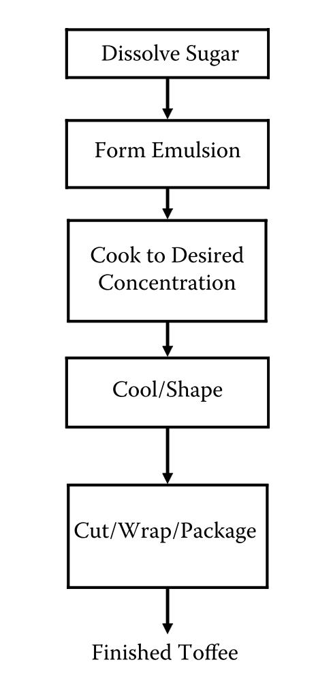
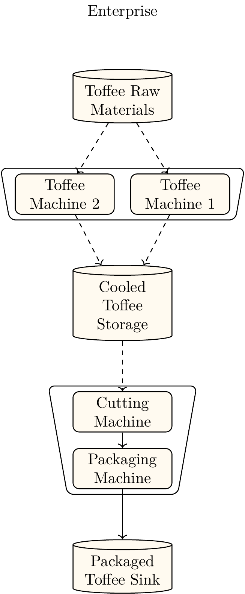
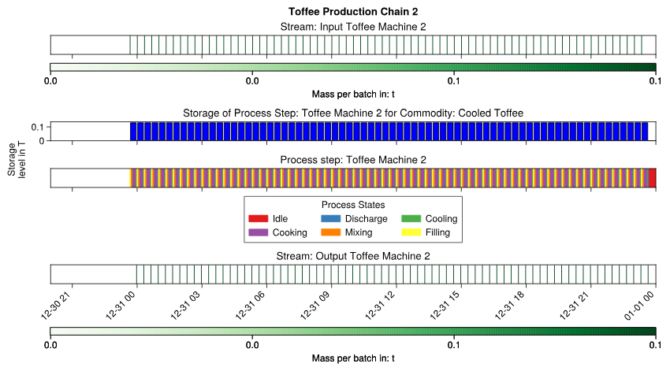
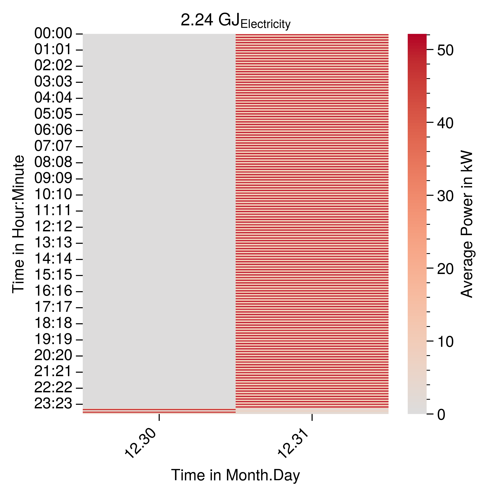
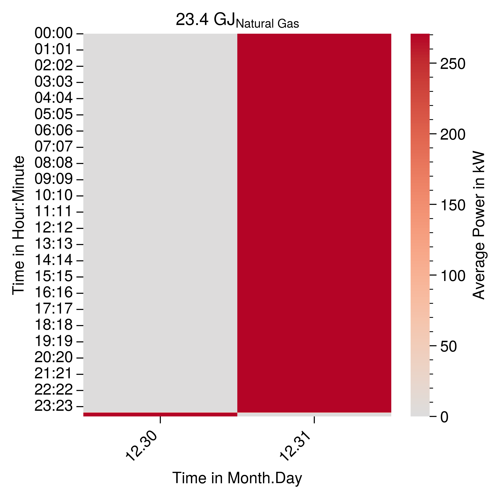
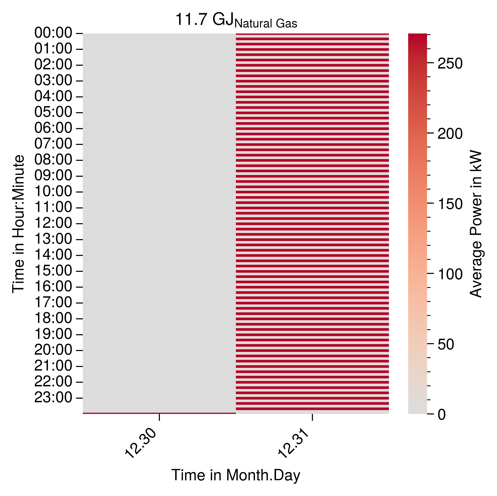
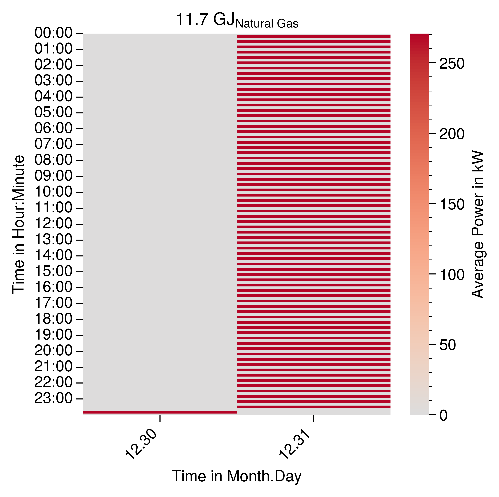

# Example: Toffee Production

This examples how the load profile of a toffee production process can be modelled. The processes modelled is a simplified version of the toffee production process described in {cite}`.2006` S.~32. The results are not validates and the purpose of the model is to show the modeling capabilities of ETHOS.PeNALPS.

:::{figure-md} toffee_production_process_description

Description of the toffee production process {cite}`.2006` S.~32.
:::

# ETHOS.PeNALPS Model

:::{figure-md} process_network_model_toffee_production

Model of a batch toffee production system. 
:::

# Capacity Parameters

A demonstrative correlation for capacities and and throughput of toffee machines is provided manufacturer CHOCOTECH. {cite}`.ChocoTecCarastar` 
For their Machine Carastar they provide

- Capacity $180 kg/h$ Batch Size $60 kg$
- Capacity $400 kg/h$ Batch Size $130 kg$
- Capacity $500 kg/h$ Batch Size $170 kg$
- Capacity $750 kg/h$ Batch Size $250 kg$

The data shows that the capacity is approximately three times the batch size. The example models batch size of 130 kg and a capacity of $390 kg/h$.
By dividing capacity/batch size a turnover time of about 20 minutes is calculated. It is assumed that step 1-4 are conducted in the toffee machine. The individual process time are assumed so that the total turnover time is 20 minutes:
- Input of materials / 2 Minutes
- Dissolving of sugars, Form Emulsions (Mixing) / 4 Minutes
- Cooking to the desired concentration (Cooking) / 10 Minutes
- Cooling / 2 Minutes
- Output of materials / 2 Minutes

The capacity of the cutting  and packaging machine is assumed to be 780 kg/h so that is matches the capacity of both toffee machines. 

# Energy Demands

Mass specific energy demands are required for each state of process step. In this case energy demands are required for the states of the toffee machine and the packaging and cutting machine. 

# Toffee  Machine
For the toffee machine the energy data was not available for each state.

## Heat Demand Toffee Machine
Thus it is estimated based on a cumulated value of $1.25 GJ/ton$ {cite}`Wojdalski.2015` S.~185.

## Electricity Demand Toffee Machine
$42 kWh/ton = 151.2 MJ/ton$
- Input of materials / 5 % / $7.56 MJ/ton$
- Dissolving of sugars, Form Emulsions (Mixing) /60 % / $90.72 MJ/ton$
- Cooking to the desired concentration (Cooking) /20 % / $30.24 MJ/ton$
- Cooling / 2 Minutes / 10 % / $15.12 MJ/ton$
- Output of materials / 5 % / $7.56 MJ/ton$
  
$2.2kW$ peak {cite}`Wojdalski.2015` S.~187 Batch confectioner

# Packaging and Cutting Machine
&3kW& peak {cite}`Wojdalski.2015` S.~187
The cutting wrapping and packaging line is modelled as two sequential machines and stream conveyor belt. 
It is assumed that the packaging lines constantly works at peak power. This leads to a total specific energy demand of $13.846 MJ/ton$. This is disaggregation onto the modeling objects as follow.

- Cutting Machine / 45% / $6.2307 MJ/ton$
- Packaging Machine / 45% / $6.2307 MJ/ton$
- Conveyor belt / 10% / $1.3846 MJ/ton$

# Simulation Results
## Production Plan

{numref}`toffee-machine-1-gantt-chart` shows the Gantt Chart of the process chain that contains the cutting machine and the open roller furnace. The cutter is idle most of the time because the cutting requires less time than the heating process.
The open roller furnace operates continuously.

:::{figure-md} toffee-machine-1-gantt-chart

Gantt chart of the toffee machine 1.
:::

{numref}`toffee-machine-2-gantt-chart` shows the Gantt Chart of forming and quenching machine as well as the trimming machine.

:::{figure-md} toffee-machine-2-gantt-chart

Gantt chart of the toffee machine 2.
:::

## Load Profiles

The load profiles for the complete electricity demand and natural gas is shown in {numref}`toffee-production-system-complete-electricity-demand` and in {numref}`toffee-production-system-complete-natural-gas-demand`. The fluctuations in the electricity demand are caused by the different electricity demands of the production phases. The natural gas demand of the whole production system is constant even though the natural gas demand of an individual toffee machine is not constant which can be seen in {numref}`toffee-machine-1-carpet-plot-natural-gas` and  {numref}`toffee-machine-1-carpet-plot-natural-gas`. The reason for constant natural gas demand is that the operation of the toffee machines is shifted by exactly one batch to batch time.

:::{figure-md} toffee-production-system-complete-electricity-demand

Carpet plot of the electricity load profile for the toffee production.
:::

:::{figure-md} toffee-production-system-complete-natural-gas-demand

Carpet plot of the natural gas load profile for the toffee production.
:::

:::{figure-md} toffee-machine-1-carpet-plot-natural-gas

Carpet plot of the natural gas load profile for the toffee machine 1.
:::

:::{figure-md} toffee-machine-2-carpet-plot-natural-gas

Carpet plot of the natural gas load profile for the toffee machine 2.
:::