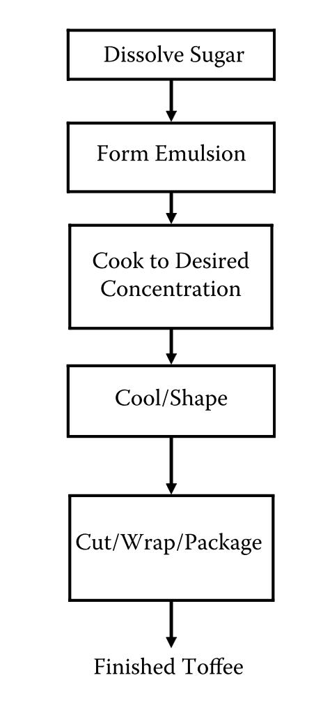
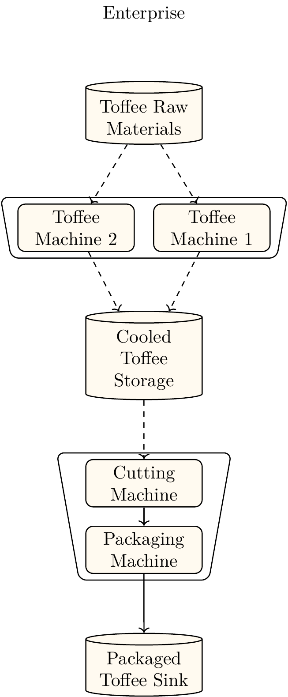

# Example: Toffee Production

This examples how the load profile of a toffee production process can be modelled. The processes modelled is a simplified version of the toffee production process described in {cite}`.2006` S.~32


:::{figure-md} toffee_production_process_description


Description of the toffee production process {cite}`.2006` S.~32 .
:::

# The Model

:::{figure-md} process_network_model_toffee_production


Model of batch toffee production based on the process description in 
:::

# Capacity related parameters

A demonstrative correlation for capacities and and throughput of toffee machines is provided manufacturer CHOCOTECH. {cite}`.ChocoTecCarastar` 
For their Machine Carastar they provide

- Capacity 180 kg/h Batch Size 60
- Capacity 400 kg/h Batch Size 130
- Capacity 500 kg/h Batch Size 170
- Capacity 750 kg/h Batch Size 250

The data shows that the capacity is approximately three times batch size. The example models batch size of 130 kg and a capacity of 390 kg/h.
By dividing capacity/batch size a turnover time of about 20 minutes is calculated. It is assumed that step 1-4 are conducted in the toffee machine. The individual process time are assumed so that the total turnover time is 20 minutes:
- Input of materials / 2 minutes
- Dissolving of sugars, Form Emulsions (Mixing) /4 Minutes
- Cooking to the desired concentration (Cooking) /10 Minutes
- Cooling / 2 Minutes
- Output of materials / 2 minutes

The capacity of the cutting  and packaging machine is assumed to be 780 kg/h so that is matches the capacity of both toffee machines. 

# Energy Demands

Mass specific energy demands are required for each state of a machine. 

 aThese are often not directly available and thus must be calculated and estimated from other energy related values. Energy demands are required for the states of the toffee machine and the packaging and cutting machine. 

# Toffee  Machine
For the toffee machine the energy data was not available for each state.

## Heat Demand Toffee Machine
Thus it is estimated based on a cumulated value of 1.25 GJ/ton= {cite}`Wojdalski.2015` S.~185.

## Electricity Demand Toffee machine
42 kWh/ton = 151.2 MJ/ton
- Input of materials / 5 % / 7.56 MJ/ton
- Dissolving of sugars, Form Emulsions (Mixing) /60 % /90.72 MJ/ton
- Cooking to the desired concentration (Cooking) /20 % / 30.24 MJ/ton
- Cooling / 2 Minutes / 10 % / 15.12 MJ/ton
- Output of materials / 5 % /7.56 MJ/ton
  
2.2kW peak {cite}`Wojdalski.2015` S.~187 Batch confectioner


# Packaging and Cutting machine
3 kW peak {cite}`Wojdalski.2015` S.~187
The cutting wrapping and packaging line is modelled as two sequential machines and stream conveyor belt. 
It is assumed that the packaging lines constantly works at peak power. This leads to a total specific energy demand of 13.846 MJ/ton. This is disaggregation onto the modeling objects as follow.

- Cutting Machine / 45% / 6.2307 MJ/ton
- Packaging Machine / 45% / 6.2307 MJ/ton
- Conveyor bel / 10% / 1.3846 MJ/ton

```{bibliography}
```