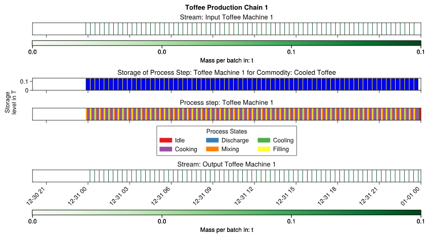

# ETHOS.PeNALPS Workflow on the Example of a Toffee Production Process

The ETHOS.PeNALPS workflow is demonstrated using the example of a simplified toffee production process described by Korovessi and Linninger {cite}`Korovessi.2005` p. 31-32. During the process, the raw toffee materials are mixed, cooked and cooled in a toffee machine. The cooled toffee is then cut and packaged in two successive machines. The corresponding model is depicted in {numref}`fig:Graphical-Abstract-Toffee`. The energy values are taken from similar machines in {cite}`Wojdalski.2015` and should be interpreted as a non validated showcase example.

:::{figure-md} fig:Graphical-Abstract-Toffee

Representation of the main conceptual objects of ETHOS.PeNALPS. (a) Representation of the toffee production process model. (b) Representation of the production plan of a single toffee machine, the cutting machine, the packaging machine. (c) The resulting electricity and natural gas load profile of a single toffee machine, the cutting machine and the packaging machine.
:::

## Introduction of the Conceptual Objects of ETHOS.PeNALPS
The nodes in the material flow simulation are (a) first named by their generic name and their specific name in the example in brackets. It is assumed that the process consists of two toffee machines operating in parallel. The produced toffee is cut and packaged by two sequentially arranged machines. 

The activity of the machines and streams is tracked in the production plan (b), which is partially shown in the figure. Based on the states of the process steps and streams, load profiles (c) are calculated using specific energy demands.

The simulation is started by passing a set of orders for packaged toffee to the packaged toffee sink. It then generates requests for the upstream node, which is the packaging machine. This in turn triggers a chain of upstream requests until it reaches the source. 

## Introduction of the Petri Net of a Process Step
While fulfilling the request, a process node switches a cycle through its Petri Net. {numref}`fig:depiction-petri-net` displays an example Petri Net for the toffee machine. The places of the Petri Net are the machine states of the modeled machine. There are four types of states:

- Idle state (yellow), which is the start and end point
- Input state (green), determines the activity of the input stream
- Output state (red), determines the activity of the output stream
- Intermediate state (gray), resembles a specific task or phase of production

They are ordered by time of occurrence during production. To satisfy a request for an output stream, the process step switches from idle state to idle state for a full cycle. Each active state during the switch cycle is tracked in the production plan, which simulates the machine’s activity. Even though the states are stored in the correct forward temporal order, the internal switches occur in the opposite temporal direction. This is useful because the output request passed to the process step only provides only the required time frame for the output state.

:::{figure-md} fig:depiction-petri-net

This figure shows the Petri Net of the example toffee machine and how it determines the activity of the machine in the production plan.
:::

The packaging machine and the cutting machine have only one state apart from their idle state, which are termed "Cutting" and "Packaging", respectively. Each state can be associated with a specific energy demand, that causes an energy demand during the activity of the respective state. Thus, the sequential activity of the states can be used to model the energy demand fluctuations in the load profile. An energy demand can also be attributed to a stream to model a conveyor belt or pump, for instance.

# Parametrization
## Capacity

A demonstrative correlation for capacities and and throughput of toffee machines is provided manufacturer CHOCOTECH. {cite}`.ChocoTecCarastar` 
For their Machine Carastar they provide

- Capacity $180 kg/h$ Batch Size $60 kg$
- Capacity $400 kg/h$ Batch Size $130 kg$
- Capacity $500 kg/h$ Batch Size $170 kg$
- Capacity $750 kg/h$ Batch Size $250 kg$

The data shows that the capacity is approximately three times the batch size. The example models batch size of 130 kg and a capacity of $390 kg/h$.
By dividing capacity/batch size a turnover time of about 20 minutes is calculated. It is assumed that step 1-4 are conducted in the toffee machine. The individual process time are assumed so that the total turnover time is 20 minutes:
- Input of materials / 2 Minutes
- Dissolving of sugars, Form Emulsions (Mixing) / 4 Minutes
- Cooking to the desired concentration (Cooking) / 10 Minutes
- Cooling / 2 Minutes
- Output of materials / 2 Minutes

The capacity of the cutting  and packaging machine is assumed to be 780 kg/h so that is matches the capacity of both toffee machines. 

## Energy Demand

Mass specific energy demands are required for each state of process step. In this case energy demands are required for the states of the toffee machine and the packaging and cutting machine. 

### Toffee  Machine
For the toffee machine the energy data was not available for each state.

### Heat Demand Toffee Machine
Thus it is estimated based on a cumulated value of $1.25 GJ/ton$ {cite}`Wojdalski.2015` p. 185.

### Electricity Demand Toffee Machine
$42 kWh/ton = 151.2 MJ/ton$
- Input of materials / 5 % / $7.56 MJ/ton$
- Dissolving of sugars, Form Emulsions (Mixing) /60 % / $90.72 MJ/ton$
- Cooking to the desired concentration (Cooking) /20 % / $30.24 MJ/ton$
- Cooling / 2 Minutes / 10 % / $15.12 MJ/ton$
- Output of materials / 5 % / $7.56 MJ/ton$
  
$2.2kW$ peak {cite}`Wojdalski.2015` p. 187 Batch confectioner

### Packaging and Cutting Machine
&3kW& peak {cite}`Wojdalski.2015` p. 187
The cutting wrapping and packaging line is modelled as two sequential machines and stream conveyor belt. 
It is assumed that the packaging lines constantly works at peak power. This leads to a total specific energy demand of $13.846 MJ/ton$. This is disaggregation onto the modeling objects as follow.

- Cutting Machine / 45% / $6.2307 MJ/ton$
- Packaging Machine / 45% / $6.2307 MJ/ton$
- Conveyor belt / 10% / $1.3846 MJ/ton$

# Simulation Results
## Production Plan

{numref}`toffee-machine-1-gantt-chart` shows the Gantt Chart of the process chain that contains the cutting machine and the open roller furnace. The cutter is idle most of the time because the cutting requires less time than the heating process.
The open roller furnace operates continuously.

:::{figure-md} toffee-machine-1-gantt-chart

Gantt chart of the toffee machine 1.
:::

{numref}`toffee-machine-2-gantt-chart` shows the Gantt Chart of forming and quenching machine as well as the trimming machine.

:::{figure-md} toffee-machine-2-gantt-chart

Gantt chart of the toffee machine 2.
:::

## Load Profiles

The load profiles for the complete electricity demand and natural gas is shown in {numref}`toffee-production-system-complete-electricity-demand` and in {numref}`toffee-production-system-complete-natural-gas-demand`. The fluctuations in the electricity demand are caused by the different electricity demands of the production phases. The natural gas demand of the whole production system is constant even though the natural gas demand of an individual toffee machine is not constant which can be seen in {numref}`toffee-machine-1-carpet-plot-natural-gas` and  {numref}`toffee-machine-1-carpet-plot-natural-gas`. The reason for constant natural gas demand is that the operation of the toffee machines is shifted by exactly one batch to batch time.

:::{figure-md} toffee-production-system-complete-electricity-demand

Carpet plot of the electricity load profile for the toffee production.
:::

:::{figure-md} toffee-production-system-complete-natural-gas-demand

Carpet plot of the natural gas load profile for the toffee production.
:::

:::{figure-md} toffee-machine-1-carpet-plot-natural-gas

Carpet plot of the natural gas load profile for the toffee machine 1.
:::

:::{figure-md} toffee-machine-2-carpet-plot-natural-gas

Carpet plot of the natural gas load profile for the toffee machine 2.
:::