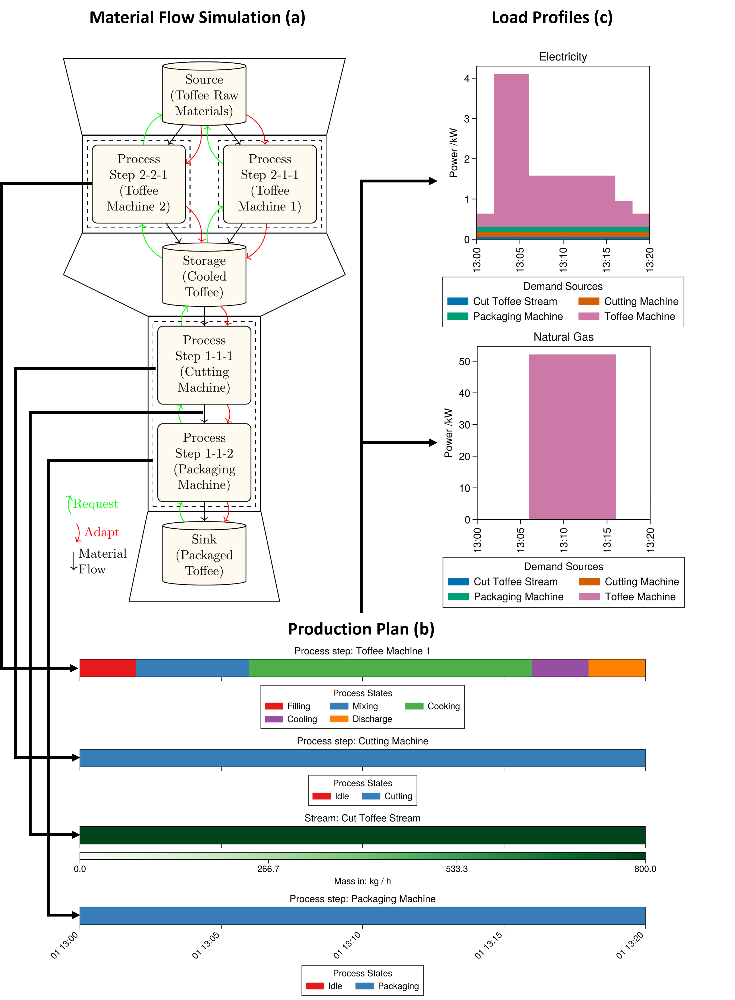

# Summary
ETHOS.PeNALPS (Petri Net Agent-based Load Profile Simulator) is a Python library for
simulating the of load profiles of industrial manufacturing processes for arbitrary energy carriers. It is part of ETHOS (Energy Transformation Pathway Optimization Suite). Load profiles are energy demand time series. Processes that can be simulated using ETHOS.PeNALPS include, for example, steel, paper, and industrial food production.

Figure \ref{fig:Main Component Overview} shows the main conceptual objects of ETHOS.PeNALPS which are: 

- Generic model objects
- Material flow simulations 
- Production plans
- Result load profiles

The model of the material flow simulation is created by users based on generic simulation objects. After the material flow simulation is completed, a set of production orders is passed to the model to start the simulation. The simulation generates a production plan that tracks the activity of each node to fulfill the requested set of orders. Based on the activity in the production plan, the load profiles are created for each node in therein.

{width=100%}

# Statement of Need
Load profiles are of particular interest for assessing energy demand fluctuations in energy system modeling and design. For industrial processes, load profiles are often not available for open research due to:

- Efforts by enterprises to protect commercial secrets;
- Missing measurements; 
-	Unstructured energy data collection in enterprises;
-	Novelty of the industrial processes and their currently missing implementation.

ETHOS.PeNALPS can provide these missing load profiles via simulation.

# Method

ETHOS.PeNALPS is capable of modeling noncyclical industrial production networks. The simulation is created from generic objects, which are shown in Figure \ref{fig:Main Component Overview}. The most important components are the generic nodes that handle and create the material requests as agents. The generic node types are: 

- Source
- Sink
- Process step
- Storage

These nodes are connected by streams that determine the direction of the material flow in the simulation. Sequentially-dependent nodes and streams are combined in so-called process chains. Multiple or single process chains are integrated into a network level. Multiple chains in a single network level model the parallel operation of similar equipment. Multiple network levels can be used to model network features of the industrial process. 

A single network level starts with a source and ends with a sink, which determines the start and end points of the material within that level. To connect two network levels, the source of one network level and the sink of another are replaced by a shared storage. 

Each of the nodes acts as an agent that handles material requests.

- Sources only provide materials and sinks only request them. 
- Process steps and storages provide and request materials. 
  
To initiate the simulation, the first request is created in the sink from the production order. These requests are are then passed to the upstream until they reach the source of the network. Within a chain, a request can be adapted if it can be fulfilled in time. The adaptation shifts the request to an earlier time, so that the deadline is always met.

The behavior of a process step during the fulfillment of a request is determined by a sequence of states that are stored in a petri net. A petri net is a state transition system which consists of places, transitions, and arcs [@Peterson.1977]. The states can be as simple as on or off switches or constitute a complex network of states during production. The combination of a petri net and process step agent is the main novelty of the tool and thus provides its name. 

# Example: Toffee Production
The ETHOS.PeNALPS workflow is demonstrated based on the example of a simplified toffee production process, which is described by Korovessi and Linninger [-@Korovessi.2005 p. 31-32]. During the process, the raw toffee materials are mixed, cooked, and cooled in a toffee machine. The cooled toffee is then cut and packaged in two-subsequential machines. The corresponding model is depicted in Figure \ref{fig:Graphical Abstract}. The energy values are taken from similar machines from [@Wojdalski.2015] and should be interpreted as an non validated showcase example. The nodes in the material flow simulation are (a) first named by their generic name and its specific name in the example in brackets. It is assumed that the process consists of two toffee machines that operate in parallel. The toffee produced is cut and packaged by two sequentially-ordered machines. 
The activity of the machines and streams is tracked in the production plan (b), which is partially shown in the figure. Based on the states of the process steps and streams, load profiles (c) are calculated using specific energy demands.

{width=100%}

The simulation is begun by passing a set of orders for packed toffee to the packaged toffee sink. It then generates requests for the upstream node, which is the packaging machine. This in turn triggers a chain of upstream requests until it reaches the source. 

While fulfilling the request, a process node switches a cycle through its petri net. Figure \ref{fig:Process State network} displays an example petri net for the toffee machine. The places of the petri net are the machine states of the modeled machine. There are four different kinds of states:

- Idle state (yellow), which is the start and end point
- Input state (green), determines the activity of the input stream
- Output state (red), determines the activity of the output stream
- Intermediate state (gray), resembles a specific task or phase of the production

They are ordered by temporal occurrence during production. To fulfill a request for an output stream, the process step switches over a full cycle from idle state to idle state. Each active state during the switch cycle is tracked in the production plan, which simulates the machine’s activity. Even though the states are stored in the correct forward temporal order, the internal switches occur in the opposite temporal direction. This is useful because the output request that is passed to the process step only provides the required time frame for the output state.

{width=100%}

The packaging and cutting machine only have one state apart from their idle state, which are termed "Cutting" and "Packaging", respectively. Each state can be associated with a specific energy demand that causes an energy demand during the activity of the respective state. Thus the sequential activity of the states can be used to model the energy demand fluctuations in the load profile. Furthermore, an energy demand can also be attributed to a stream to model a conveyor belt or pump, for instance.

# Other Tools and Methods

To overcome the lack of industrial load profiles, simulation tools and methods have been developed. However, most of these are not open source or are a method rather than a reusable tool. 

@Kohl.2014 proposed using a material flow simulation created by the commercial tool Plant Simulation to simulate the load profiles of the manufacturing processes. Measured load profiles were then allocated to the internal machine states using the observer pattern. 

@Binderbauer.2022 published a study on the “Ganymede” software, which also uses a material flow simulation to simulate load profiles. The material flow simulation is based on a discrete event simulation. Ganymede only distinguishes between continuous and batch process steps. In order to implement more detailed load profiles of machines, external load profiles are required for the respective machines. These are difficult to obtain for many machines, especially as machine-readable data.

@Li.2022 implemented a petri net to forecast the energy demand of individual machines in real time. This approach lacks a method to coordinate the activity of multiple machines that are connected in a network.

@Dock.2021 created a discrete event based on a material flow simulation for an electric arc furnace plant. It uses a parameterized Markov Chain load profile model to generate load profiles for the electric arc furnace. Neither the Markov Chain parameters nor the load profile used for parametrization have been published. Moreover, maintenance activity and interdependent activity are implemented for some of the process steps. The applicability of the model to other industrial processes cannot be verified, because the source code of the model has not been published.

@Sandhaas.2022 use a different approach to generate load profiles which is not based on a material flow simulation. Rather, their approach is based on the recombination of eight standard load profiles of appliances, which are used to model the load profile of an industry. For a specific industry the share of each appliance of the standard load profiles is determined. These shares are then used as weights in th recombination of the standard load profiles. Furthermore, some stochastic fluctuation is applied to the recombined load profile. This approach requires less input data, but cannot model any features that are not contained in the standard load profiles. It has been published as an open-source code.

The software eLOAD employs an approach similar to that from Sandhaas. Instead of applying it to individual industries, @Bomann.2015 applies it at a national level. They also assume demand response flexibility for some appliances. The source code and appliance load profiles used have also not been published. 

# References